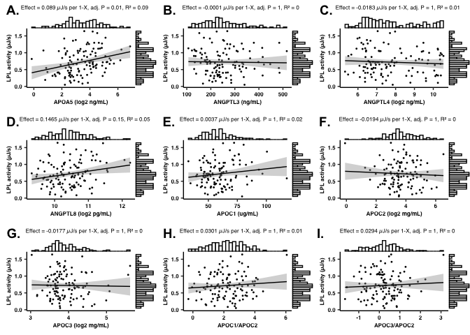
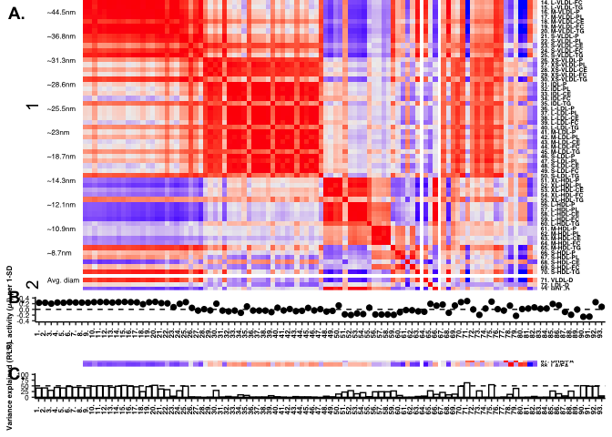
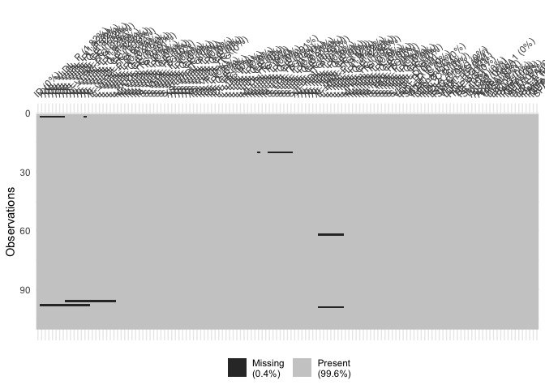
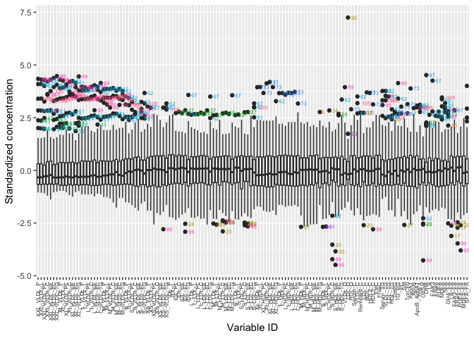
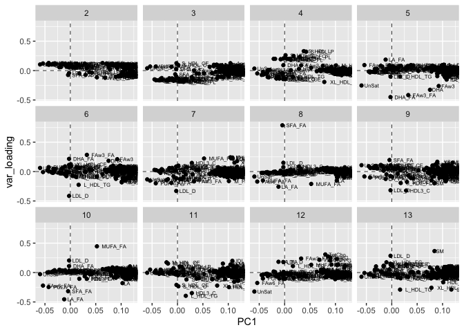
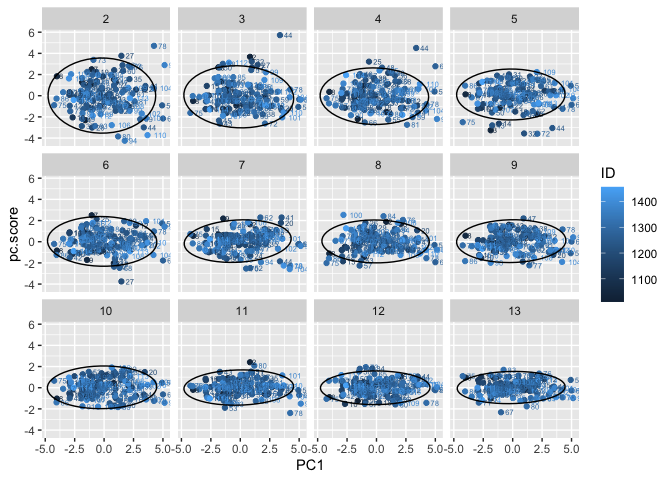
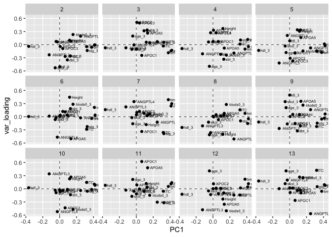
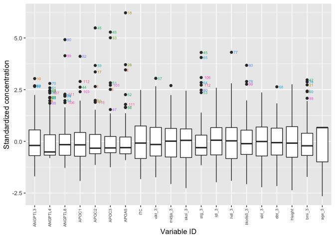

VIPVIZA-LPL
================

  - [Analysis output](#analysis-output)
      - [Figure 1. Scatter plots, LPL control
        proteins](#figure-1.-scatter-plots-lpl-control-proteins)
      - [Figure 2. NMR heatmap, forest plot and bar
        plot](#figure-2.-nmr-heatmap-forest-plot-and-bar-plot)
      - [Table 1. Descriptive statistics, study
        participants.](#table-1.-descriptive-statistics-study-participants.)
      - [Table S1-2. NMR summary stats (S1) and linear regression
        results
        (S2)](#table-s1-2.-nmr-summary-stats-s1-and-linear-regression-results-s2)
  - [Preprocessing](#preprocessing)
      - [NMR](#nmr)
          - [A. Pre-imputation
            diagnostics](#a.-pre-imputation-diagnostics)
          - [B. Post-imputation
            diagnostics](#b.-post-imputation-diagnostics)
          - [C. Outlier analysis](#c.-outlier-analysis)
      - [Sample metadata](#sample-metadata)
          - [A. Pre-imputation
            diagnostics](#a.-pre-imputation-diagnostics-1)
          - [B. Post-imputation
            diagnostics](#b.-post-imputation-diagnostics-1)
          - [C. Outlier analysis](#c.-outlier-analysis-1)
      - [Session info:](#session-info)

Clear environment:

# Analysis output

## Figure 1. Scatter plots, LPL control proteins

[Click here to download high-resolution
version](https://github.com/fredlandfors/VIPVIZA-LPL/blob/master/out/figure_1.pdf)

Thumbnail:

``` r
figure_1_ggdraw
```

<!-- -->

## Figure 2. NMR heatmap, forest plot and bar plot

[Click here to download high-resolution
version](https://github.com/fredlandfors/VIPVIZA-LPL/blob/master/out/figure_2.pdf)

Thumbnail:

``` r
figure_22
```

<!-- -->

## Table 1. Descriptive statistics, study participants.

[Click here to download xlsx
file](https://github.com/fredlandfors/VIPVIZA-LPL/blob/master/out/table_1.xlsx)

## Table S1-2. NMR summary stats (S1) and linear regression results (S2)

[Click here to download xlsx
file](https://github.com/fredlandfors/VIPVIZA-LPL/blob/master/out/table_S1-2.xlsx)

# Preprocessing

## NMR

### A. Pre-imputation diagnostics

``` r
dim(unproc_samplemeta)
```

    ## [1] 117  22

``` r
tempData_samplemeta$data$percent_missing
```

    ##        ID     sex_3    Height   ANGPTL3     APOC2     APOC3     APOA5       ITC 
    ## 0.0000000 0.0000000 0.0000000 0.0000000 0.0000000 0.0000000 0.0000000 0.0000000 
    ##     age_3   ANGPTL4   ANGPTL8     APOC1    vikt_3    skol_3     stg_3  blods0_3 
    ## 0.0000000 0.8547009 0.8547009 0.8547009 2.5641026 2.5641026 2.5641026 2.5641026 
    ##     sbt_3     dbt_3     bmi_3   midja_3     hdl_3     ldl_3 
    ## 2.5641026 2.5641026 2.5641026 3.4188034 3.4188034 4.2735043

``` r
tempData_samplemeta$plots$vismissplot
```

<!-- -->

### B. Post-imputation diagnostics

``` r
tempData_samplemeta$plots$scatter
```

    ## NULL

``` r
tempData_samplemeta$plots$density
```

    ## NULL

### C. Outlier analysis

PCA

``` r
plot_pca(
  Filter(is.numeric, missData.dataMatrix),
  c = missData.dataMatrix["ID"] 
)$scores_plot
```

<!-- -->

``` r
plot_pca(
  Filter(is.numeric, missData.dataMatrix),
  c = missData.dataMatrix["ID"] 
)$loadings_plot
```

<!-- -->

Column-wise boxplot

``` r
geom_cwiseboxplot(
  x = Filter(is.numeric, missData.dataMatrix),
  c = missData.dataMatrix[,"ID"]
)
```

<!-- -->

## Sample metadata

### A. Pre-imputation diagnostics

``` r
dim(unproc_samplemeta)
```

    ## [1] 117  22

``` r
tempData_samplemeta$data$percent_missing
```

    ##        ID     sex_3    Height   ANGPTL3     APOC2     APOC3     APOA5       ITC 
    ## 0.0000000 0.0000000 0.0000000 0.0000000 0.0000000 0.0000000 0.0000000 0.0000000 
    ##     age_3   ANGPTL4   ANGPTL8     APOC1    vikt_3    skol_3     stg_3  blods0_3 
    ## 0.0000000 0.8547009 0.8547009 0.8547009 2.5641026 2.5641026 2.5641026 2.5641026 
    ##     sbt_3     dbt_3     bmi_3   midja_3     hdl_3     ldl_3 
    ## 2.5641026 2.5641026 2.5641026 3.4188034 3.4188034 4.2735043

``` r
tempData_samplemeta$plots$vismissplot
```

<!-- -->

### B. Post-imputation diagnostics

``` r
tempData_samplemeta$plots$scatter
```

    ## NULL

``` r
tempData_samplemeta$plots$density
```

    ## NULL

### C. Outlier analysis

PCA

``` r
plot_pca(
  Filter(is.numeric, na.omit(missData.sampleMetadata)),
  c = na.omit(missData.sampleMetadata)["ID"]
)$scores_plot
```

<!-- -->

``` r
plot_pca(
  Filter(is.numeric, na.omit(missData.sampleMetadata)),
  c = na.omit(missData.sampleMetadata)["ID"]
)$loadings_plot
```

<!-- -->

``` r
plot_pca(
  Filter(is.numeric, na.omit(missData.sampleMetadata)),
  c = na.omit(missData.sampleMetadata)["ID"]
)$fit
```

    ## Standard deviations (1, .., p=20):
    ##  [1] 2.11199509 1.67956154 1.43462038 1.28189427 1.19440961 1.10612394
    ##  [7] 0.99936703 0.96093084 0.91801869 0.90140536 0.79288091 0.74411316
    ## [13] 0.71645457 0.62856451 0.51773351 0.46848286 0.35958456 0.27822162
    ## [19] 0.05993328 0.03216683
    ## 
    ## Rotation (n x k) = (20 x 20):
    ##                   PC1          PC2          PC3         PC4         PC5
    ## ANGPTL3  -0.123661424 -0.232368572 -0.072082695 -0.20957696 -0.41968024
    ## ANGPTL4  -0.027712929  0.063195370 -0.006037266  0.27138798  0.20982984
    ## ANGPTL8   0.247820391  0.192785201  0.067646067 -0.19249047 -0.07506123
    ## APOC1     0.064426826 -0.269288571 -0.245680479  0.06961190 -0.18790686
    ## APOC2     0.006286558 -0.043201946  0.509282542  0.32830120 -0.31084551
    ## APOC3     0.037193125 -0.088626601  0.494554252  0.27027699 -0.37206923
    ## APOA5     0.133509788  0.076823354  0.262964518 -0.07869188  0.16379730
    ## ITC       0.318942222 -0.044418488 -0.030717597  0.01320640 -0.14664753
    ## vikt_3    0.411263566 -0.007245267 -0.141594714  0.11806758  0.01536235
    ## midja_3   0.419340019 -0.006260955 -0.129322626 -0.04471267 -0.02227735
    ## skol_3   -0.052718934 -0.528968963 -0.106907017  0.06103353 -0.03151259
    ## stg_3     0.326063256 -0.134161312  0.051790709  0.10526785 -0.14982830
    ## ldl_3     0.001177634 -0.505061429 -0.099655913  0.07266131  0.08704950
    ## hdl_3    -0.366609175 -0.038572696 -0.071987191 -0.08952608 -0.13222657
    ## blods0_3  0.158012286  0.230610489  0.043932234 -0.23941029 -0.14525688
    ## sbt_3     0.127680763 -0.258478889  0.334125966 -0.33373717  0.33576631
    ## dbt_3     0.091243500 -0.348466301  0.316833495 -0.22128823  0.33876823
    ## Height    0.117437095  0.100266559  0.055674813  0.36863334  0.30575488
    ## bmi_3     0.379135451 -0.058951949 -0.184621437 -0.10134822 -0.17779092
    ## age_3    -0.042278284  0.072861411  0.196594884 -0.49544028 -0.18046549
    ##                   PC6         PC7          PC8          PC9        PC10
    ## ANGPTL3   0.013995096  0.22483008 -0.208570413 -0.268424877  0.34165140
    ## ANGPTL4  -0.466636436  0.34552916 -0.363875852 -0.163995278 -0.52064999
    ## ANGPTL8  -0.025214337 -0.12289298 -0.507996062  0.161328352 -0.03811673
    ## APOC1     0.111497088 -0.33706462 -0.068540938 -0.153896310 -0.43448380
    ## APOC2     0.035743619  0.09652954 -0.003027523  0.004334602 -0.06383414
    ## APOC3     0.120696783  0.12285130  0.045132444  0.053313707 -0.04084340
    ## APOA5    -0.502625001  0.03016236  0.077189785  0.352982062  0.26947778
    ## ITC      -0.285741817 -0.35956053  0.157676782 -0.223829480  0.14703584
    ## vikt_3    0.212682989  0.24513952 -0.155181586 -0.030721264  0.10415127
    ## midja_3   0.036859951  0.29796172 -0.046270487  0.062352124  0.08266275
    ## skol_3   -0.064480264 -0.01990451 -0.124150519  0.344902781 -0.03157044
    ## stg_3    -0.225583381 -0.38634169 -0.094962174 -0.146437623 -0.05480082
    ## ldl_3     0.013170417  0.04269359  0.010980618  0.495482621 -0.02342216
    ## hdl_3     0.005165977  0.16206904 -0.245740817 -0.121103783  0.02459861
    ## blods0_3  0.284578434  0.06457801  0.279702702  0.265008575 -0.46995850
    ## sbt_3     0.183675498  0.02281452  0.035515678 -0.210534091 -0.13446774
    ## dbt_3     0.039018159  0.07810374  0.014925821 -0.325207864 -0.01381181
    ## Height    0.445913319 -0.17951436 -0.402261798  0.047208573  0.22771181
    ## bmi_3    -0.038840266  0.38941734  0.077660380 -0.053311436 -0.01519812
    ## age_3    -0.020783313 -0.15956121 -0.411998238  0.207359365 -0.08908956
    ##                  PC11         PC12         PC13        PC14         PC15
    ## ANGPTL3  -0.029492073 -0.478782239  0.003748445 -0.40858855  0.046329639
    ## ANGPTL4  -0.056254436 -0.131645947  0.200369638 -0.20905427 -0.015501129
    ## ANGPTL8  -0.304731506 -0.142510851 -0.567513322  0.10957347 -0.242563165
    ## APOC1     0.623563445 -0.107593197 -0.263728846 -0.01864502 -0.010491001
    ## APOC2     0.088448647  0.114732614 -0.083821612  0.07002545 -0.475466312
    ## APOC3    -0.002106969  0.014392572  0.018246339 -0.02520037  0.355058687
    ## APOA5     0.481322595 -0.352602662 -0.093021855  0.12320334  0.158592308
    ## ITC      -0.054888691 -0.140096474  0.423326360  0.05655444 -0.479559706
    ## vikt_3    0.113513531  0.043276127  0.094000526  0.13067674  0.071588744
    ## midja_3   0.140196344  0.116696749  0.077946263 -0.04529747 -0.062918501
    ## skol_3   -0.171554691 -0.046897051  0.117678454  0.21685959  0.008539479
    ## stg_3    -0.318103815  0.020737448  0.048865424  0.14083535  0.516893179
    ## ldl_3    -0.114243057  0.002262186  0.023693406 -0.18346225 -0.166246029
    ## hdl_3     0.080065470 -0.124284600  0.178765594  0.74702192 -0.016720222
    ## blods0_3 -0.147321476 -0.501821700  0.252497273  0.07274797 -0.014028605
    ## sbt_3     0.033220784 -0.091865082 -0.030447479  0.00460940  0.084194965
    ## dbt_3    -0.055476108  0.009715820 -0.037849565  0.09595566 -0.132209418
    ## Height    0.120623764 -0.233967441  0.268209238 -0.02844548  0.013960817
    ## bmi_3     0.054265218  0.219627843 -0.056405927  0.16754451  0.036170793
    ## age_3     0.213911665  0.409044038  0.409997318 -0.17885534  0.029694811
    ##                  PC16         PC17         PC18          PC19          PC20
    ## ANGPTL3   0.145610396 -0.030863865  0.032287419 -0.0058124320 -0.0007816670
    ## ANGPTL4  -0.063474737 -0.026426846  0.025479887 -0.0064174920 -0.0006469570
    ## ANGPTL8  -0.213158922  0.036596858 -0.002679158 -0.0010754002  0.0028921755
    ## APOC1    -0.037852134  0.084287294 -0.023145912 -0.0104340128 -0.0041082879
    ## APOC2     0.466252307 -0.206438145  0.009348087  0.0232268282 -0.0010371868
    ## APOC3    -0.577456675  0.186227860 -0.053469221 -0.0154424476  0.0021451103
    ## APOA5     0.079725355  0.022762835  0.074300344 -0.0017318526 -0.0022193888
    ## ITC      -0.357275688 -0.039074672  0.043868753  0.0038908566 -0.0057281078
    ## vikt_3    0.009702441 -0.020400186  0.361570265  0.6883812247  0.0669107169
    ## midja_3   0.036497682  0.047120466 -0.807754415 -0.0094851435  0.0205970520
    ## skol_3    0.030342691 -0.049123184 -0.009778198 -0.0761594458  0.6778895419
    ## stg_3     0.390637566 -0.052126671 -0.090928421  0.0140146900 -0.2259609255
    ## ldl_3    -0.073004489 -0.004137491  0.051446167  0.0698001806 -0.6214297409
    ## hdl_3    -0.074334404 -0.038439601 -0.143693174  0.0330533628 -0.3009934192
    ## blods0_3  0.168860296  0.123452849  0.021805309 -0.0047039753 -0.0003143448
    ## sbt_3    -0.162207269 -0.660547058 -0.054481157  0.0001427871 -0.0044890138
    ## dbt_3     0.130153043  0.664963199  0.043284205 -0.0072370066  0.0007211060
    ## Height    0.053500435  0.026504662  0.047556015 -0.3835945099 -0.0389447282
    ## bmi_3    -0.002207366 -0.060287894  0.394090947 -0.6047665307 -0.0782573744
    ## age_3     0.051163852  0.056790450  0.098129078  0.0117109150  0.0016793697

Column-wise boxplot

``` r
geom_cwiseboxplot(
  x = Filter(is.numeric, missData.sampleMetadata),
  c = missData.sampleMetadata[,"ID"]
)
```

    ## Warning: Removed 3 rows containing non-finite values (stat_boxplot).
    
    ## Warning: Removed 3 rows containing non-finite values (stat_boxplot).

<!-- -->

## Session info:

``` r
sessionInfo()
```

    ## R version 4.0.2 (2020-06-22)
    ## Platform: x86_64-apple-darwin17.0 (64-bit)
    ## Running under: macOS Catalina 10.15.4
    ## 
    ## Matrix products: default
    ## BLAS:   /Library/Frameworks/R.framework/Versions/4.0/Resources/lib/libRblas.dylib
    ## LAPACK: /Library/Frameworks/R.framework/Versions/4.0/Resources/lib/libRlapack.dylib
    ## 
    ## locale:
    ## [1] sv_SE.UTF-8/sv_SE.UTF-8/sv_SE.UTF-8/C/sv_SE.UTF-8/sv_SE.UTF-8
    ## 
    ## attached base packages:
    ## [1] stats     graphics  grDevices utils     datasets  methods   base     
    ## 
    ## other attached packages:
    ## [1] ggplot2_3.3.2
    ## 
    ## loaded via a namespace (and not attached):
    ##  [1] ComplexHeatmap_2.5.5 Rcpp_1.0.5           RColorBrewer_1.1-2  
    ##  [4] pillar_1.4.6         compiler_4.0.2       tools_4.0.2         
    ##  [7] digest_0.6.25        clue_0.3-57          evaluate_0.14       
    ## [10] lifecycle_0.2.0      tibble_3.0.3         gtable_0.3.0        
    ## [13] lattice_0.20-41      png_0.1-7            pkgconfig_2.0.3     
    ## [16] rlang_0.4.7          parallel_4.0.2       yaml_2.2.1          
    ## [19] xfun_0.16            withr_2.2.0          cluster_2.1.0       
    ## [22] dplyr_1.0.2          stringr_1.4.0        knitr_1.29          
    ## [25] S4Vectors_0.26.1     IRanges_2.22.2       GlobalOptions_0.1.2 
    ## [28] generics_0.0.2       vctrs_0.3.4          stats4_4.0.2        
    ## [31] grid_4.0.2           tidyselect_1.1.0     cowplot_1.0.0       
    ## [34] glue_1.4.2           mice_3.11.0          R6_2.4.1            
    ## [37] GetoptLong_1.0.2     rmarkdown_2.3        farver_2.0.3        
    ## [40] purrr_0.3.4          tidyr_1.1.2          magrittr_1.5        
    ## [43] MASS_7.3-52          BiocGenerics_0.34.0  scales_1.1.1        
    ## [46] backports_1.1.9      ellipsis_0.3.1       htmltools_0.5.0     
    ## [49] visdat_0.5.3         shape_1.4.4          circlize_0.4.10     
    ## [52] colorspace_1.4-1     labeling_0.3         stringi_1.4.6       
    ## [55] munsell_0.5.0        broom_0.7.0          rjson_0.2.20        
    ## [58] crayon_1.3.4
