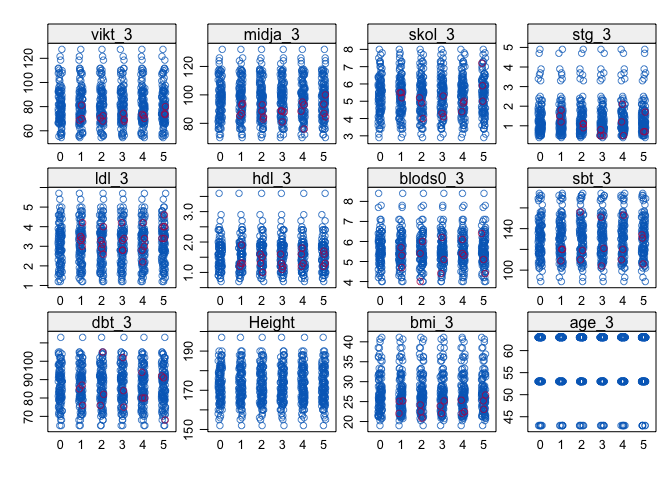

VIPVIZA-LPL
================

  - [Analysis](#analysis)
      - [Figure 1. Scatter plots, LPL control
        proteins.](#figure-1.-scatter-plots-lpl-control-proteins.)
      - [Figure 2. NMR heatmap, forest plot and bar
        plot.](#figure-2.-nmr-heatmap-forest-plot-and-bar-plot.)
      - [Table 1. Descriptive statistics, study
        participants.](#table-1.-descriptive-statistics-study-participants.)
      - [Table S1-2. NMR summary stats (S1) and linear regression
        results
        (S2).](#table-s1-2.-nmr-summary-stats-s1-and-linear-regression-results-s2.)
  - [Preprocessing](#preprocessing)
      - [NMR](#nmr)
          - [A. Pre-imputation
            diagnostics](#a.-pre-imputation-diagnostics)
          - [B. Post-imputation
            diagnostics](#b.-post-imputation-diagnostics)
          - [C. Outlier analysis](#c.-outlier-analysis)
      - [Sample metadata](#sample-metadata)
          - [A. Pre-imputation
            diagnostics](#a.-pre-imputation-diagnostics-1)
          - [B. Post-imputation
            diagnostics](#b.-post-imputation-diagnostics-1)
          - [C. Outlier analysis](#c.-outlier-analysis-1)
  - [Session info](#session-info)

Clear environment:

# Analysis

## Figure 1. Scatter plots, LPL control proteins.

[Click here to download high-resolution
version](https://github.com/fredlandfors/VIPVIZA-LPL/blob/master/out/figure_1.pdf)

Thumbnail: <!-- -->

## Figure 2. NMR heatmap, forest plot and bar plot.

[Click here to download high-resolution
version](https://github.com/fredlandfors/VIPVIZA-LPL/blob/master/out/figure_2.pdf)

Thumbnail: <!-- -->

## Table 1. Descriptive statistics, study participants.

[Click here to download xlsx
file](https://github.com/fredlandfors/VIPVIZA-LPL/blob/master/out/table_1.xlsx)

## Table S1-2. NMR summary stats (S1) and linear regression results (S2).

[Click here to download xlsx
file](https://github.com/fredlandfors/VIPVIZA-LPL/blob/master/out/table_S1-2.xlsx)

# Preprocessing

## NMR

### A. Pre-imputation diagnostics

Percent missing:

    ## [1] 117  22

    ##          ID    M_VLDL_P    M_VLDL_L   M_VLDL_PL    M_VLDL_C   M_VLDL_CE 
    ##   0.0000000   0.0000000   0.0000000   0.0000000   0.0000000   0.0000000 
    ##   M_VLDL_FC   M_VLDL_TG    S_VLDL_P    S_VLDL_L   S_VLDL_PL    S_VLDL_C 
    ##   0.0000000   0.0000000   0.0000000   0.0000000   0.0000000   0.0000000 
    ##   S_VLDL_CE   S_VLDL_FC   S_VLDL_TG   XS_VLDL_P   XS_VLDL_L  XS_VLDL_PL 
    ##   0.0000000   0.0000000   0.0000000   0.0000000   0.0000000   0.0000000 
    ##   XS_VLDL_C  XS_VLDL_CE  XS_VLDL_FC  XS_VLDL_TG       IDL_P       IDL_L 
    ##   0.0000000   0.0000000   0.0000000   0.0000000   0.0000000   0.0000000 
    ##      IDL_PL       IDL_C      IDL_CE      IDL_FC      IDL_TG     L_LDL_P 
    ##   0.0000000   0.0000000   0.0000000   0.0000000   0.0000000   0.0000000 
    ##     L_LDL_L    L_LDL_PL     L_LDL_C    L_LDL_CE    L_LDL_FC    L_LDL_TG 
    ##   0.0000000   0.0000000   0.0000000   0.0000000   0.0000000   0.0000000 
    ##     M_LDL_P     M_LDL_L    M_LDL_PL     M_LDL_C    M_LDL_FC    M_LDL_TG 
    ##   0.0000000   0.0000000   0.0000000   0.0000000   0.0000000   0.0000000 
    ##    XL_HDL_P    XL_HDL_L   XL_HDL_PL    XL_HDL_C   XL_HDL_CE   XL_HDL_FC 
    ##   0.0000000   0.0000000   0.0000000   0.0000000   0.0000000   0.0000000 
    ##   XL_HDL_TG     M_HDL_P     M_HDL_L    M_HDL_PL     M_HDL_C    M_HDL_CE 
    ##   0.0000000   0.0000000   0.0000000   0.0000000   0.0000000   0.0000000 
    ##    M_HDL_FC    M_HDL_TG     S_HDL_P     S_HDL_L    S_HDL_PL     S_HDL_C 
    ##   0.0000000   0.0000000   0.0000000   0.0000000   0.0000000   0.0000000 
    ##    S_HDL_CE    S_HDL_FC    S_HDL_TG      VLDL_D       LDL_D       HDL_D 
    ##   0.0000000   0.0000000   0.0000000   0.0000000   0.0000000   0.0000000 
    ##     Serum_C      VLDL_C   Remnant_C       LDL_C       HDL_C      HDL2_C 
    ##   0.0000000   0.0000000   0.0000000   0.0000000   0.0000000   0.0000000 
    ##      HDL3_C        EstC       FreeC    Serum_TG     VLDL_TG      LDL_TG 
    ##   0.0000000   0.0000000   0.0000000   0.0000000   0.0000000   0.0000000 
    ##      HDL_TG       TotPG       TG_PG          PC          SM      TotCho 
    ##   0.0000000   0.0000000   0.0000000   0.0000000   0.0000000   0.0000000 
    ##       ApoA1        ApoB  ApoB_ApoA1       TotFA       UnSat         DHA 
    ##   0.0000000   0.0000000   0.0000000   0.0000000   0.0000000   0.0000000 
    ##          LA        FAw3        FAw6        PUFA        MUFA         SFA 
    ##   0.0000000   0.0000000   0.0000000   0.0000000   0.0000000   0.0000000 
    ##      DHA_FA       LA_FA     FAw3_FA     FAw6_FA     PUFA_FA     MUFA_FA 
    ##   0.0000000   0.0000000   0.0000000   0.0000000   0.0000000   0.0000000 
    ##      SFA_FA    L_VLDL_P    L_VLDL_L   L_VLDL_PL    L_VLDL_C   L_VLDL_CE 
    ##   0.0000000   0.9090909   0.9090909   0.9090909   0.9090909   0.9090909 
    ##   L_VLDL_FC   L_VLDL_TG    M_LDL_CE     S_LDL_P     S_LDL_L    S_LDL_PL 
    ##   0.9090909   0.9090909   0.9090909   0.9090909   0.9090909   0.9090909 
    ##     S_LDL_C    S_LDL_CE    S_LDL_FC    S_LDL_TG  XXL_VLDL_P  XXL_VLDL_L 
    ##   0.9090909   0.9090909   0.9090909   0.9090909   1.8181818   1.8181818 
    ## XXL_VLDL_PL  XXL_VLDL_C XXL_VLDL_CE XXL_VLDL_FC XXL_VLDL_TG   XL_VLDL_P 
    ##   1.8181818   1.8181818   1.8181818   1.8181818   1.8181818   1.8181818 
    ##   XL_VLDL_L  XL_VLDL_PL   XL_VLDL_C  XL_VLDL_CE  XL_VLDL_TG     L_HDL_P 
    ##   1.8181818   1.8181818   1.8181818   1.8181818   1.8181818   1.8181818 
    ##     L_HDL_L    L_HDL_PL     L_HDL_C    L_HDL_CE    L_HDL_FC    L_HDL_TG 
    ##   1.8181818   1.8181818   1.8181818   1.8181818   1.8181818   1.8181818 
    ##  XL_VLDL_FC 
    ##   2.7272727

<!-- -->

### B. Post-imputation diagnostics

<!-- --><!-- -->

### C. Outlier analysis

PCA:

<!-- --><!-- -->

Column-wise boxplot:

<!-- -->

## Sample metadata

### A. Pre-imputation diagnostics

    ## [1] 117  22

<!-- -->

### B. Post-imputation diagnostics

<!-- --><!-- -->

### C. Outlier analysis

PCA:

<!-- --><!-- -->

Column-wise boxplot:

<!-- -->

# Session info

    ## R version 4.0.2 (2020-06-22)
    ## Platform: x86_64-apple-darwin17.0 (64-bit)
    ## Running under: macOS Catalina 10.15.4
    ## 
    ## Matrix products: default
    ## BLAS:   /Library/Frameworks/R.framework/Versions/4.0/Resources/lib/libRblas.dylib
    ## LAPACK: /Library/Frameworks/R.framework/Versions/4.0/Resources/lib/libRlapack.dylib
    ## 
    ## locale:
    ## [1] sv_SE.UTF-8/sv_SE.UTF-8/sv_SE.UTF-8/C/sv_SE.UTF-8/sv_SE.UTF-8
    ## 
    ## attached base packages:
    ## [1] stats     graphics  grDevices utils     datasets  methods   base     
    ## 
    ## other attached packages:
    ## [1] ggplot2_3.3.2
    ## 
    ## loaded via a namespace (and not attached):
    ##  [1] ComplexHeatmap_2.5.5 Rcpp_1.0.5           RColorBrewer_1.1-2  
    ##  [4] pillar_1.4.6         compiler_4.0.2       tools_4.0.2         
    ##  [7] digest_0.6.25        clue_0.3-57          evaluate_0.14       
    ## [10] lifecycle_0.2.0      tibble_3.0.3         gtable_0.3.0        
    ## [13] lattice_0.20-41      png_0.1-7            pkgconfig_2.0.3     
    ## [16] rlang_0.4.7          parallel_4.0.2       yaml_2.2.1          
    ## [19] xfun_0.16            withr_2.2.0          cluster_2.1.0       
    ## [22] dplyr_1.0.2          stringr_1.4.0        knitr_1.29          
    ## [25] S4Vectors_0.26.1     IRanges_2.22.2       GlobalOptions_0.1.2 
    ## [28] generics_0.0.2       vctrs_0.3.4          stats4_4.0.2        
    ## [31] grid_4.0.2           tidyselect_1.1.0     cowplot_1.0.0       
    ## [34] glue_1.4.2           mice_3.11.0          R6_2.4.1            
    ## [37] GetoptLong_1.0.2     rmarkdown_2.3        farver_2.0.3        
    ## [40] purrr_0.3.4          tidyr_1.1.2          magrittr_1.5        
    ## [43] MASS_7.3-52          BiocGenerics_0.34.0  scales_1.1.1        
    ## [46] backports_1.1.9      ellipsis_0.3.1       htmltools_0.5.0     
    ## [49] visdat_0.5.3         shape_1.4.4          circlize_0.4.10     
    ## [52] colorspace_1.4-1     labeling_0.3         stringi_1.4.6       
    ## [55] munsell_0.5.0        broom_0.7.0          rjson_0.2.20        
    ## [58] crayon_1.3.4
