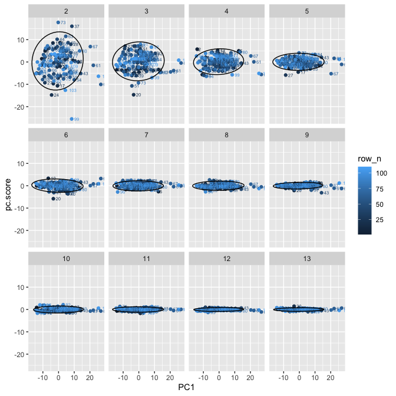

VIPVIZA-LPL
================

-   [Preprocessing](#preprocessing)
    -   [NMR](#nmr)
        -   [A. Pre-imputation
            diagnostics](#a.-pre-imputation-diagnostics)
        -   [B. Post-imputation
            diagnostics](#b.-post-imputation-diagnostics)
        -   [C. Outlier analysis](#c.-outlier-analysis)
-   [Session info](#session-info)

# Preprocessing

## NMR

### A. Pre-imputation diagnostics

Percent missing:

    ## [1] 117  22

    ##          ID    M_VLDL_P    M_VLDL_L   M_VLDL_PL    M_VLDL_C   M_VLDL_CE 
    ##   0.0000000   0.0000000   0.0000000   0.0000000   0.0000000   0.0000000 
    ##   M_VLDL_FC   M_VLDL_TG    S_VLDL_P    S_VLDL_L   S_VLDL_PL    S_VLDL_C 
    ##   0.0000000   0.0000000   0.0000000   0.0000000   0.0000000   0.0000000 
    ##   S_VLDL_CE   S_VLDL_FC   S_VLDL_TG   XS_VLDL_P   XS_VLDL_L  XS_VLDL_PL 
    ##   0.0000000   0.0000000   0.0000000   0.0000000   0.0000000   0.0000000 
    ##   XS_VLDL_C  XS_VLDL_CE  XS_VLDL_FC  XS_VLDL_TG       IDL_P       IDL_L 
    ##   0.0000000   0.0000000   0.0000000   0.0000000   0.0000000   0.0000000 
    ##      IDL_PL       IDL_C      IDL_CE      IDL_FC      IDL_TG     L_LDL_P 
    ##   0.0000000   0.0000000   0.0000000   0.0000000   0.0000000   0.0000000 
    ##     L_LDL_L    L_LDL_PL     L_LDL_C    L_LDL_CE    L_LDL_FC    L_LDL_TG 
    ##   0.0000000   0.0000000   0.0000000   0.0000000   0.0000000   0.0000000 
    ##     M_LDL_P     M_LDL_L    M_LDL_PL     M_LDL_C    M_LDL_FC    M_LDL_TG 
    ##   0.0000000   0.0000000   0.0000000   0.0000000   0.0000000   0.0000000 
    ##    XL_HDL_P    XL_HDL_L   XL_HDL_PL    XL_HDL_C   XL_HDL_CE   XL_HDL_FC 
    ##   0.0000000   0.0000000   0.0000000   0.0000000   0.0000000   0.0000000 
    ##   XL_HDL_TG     M_HDL_P     M_HDL_L    M_HDL_PL     M_HDL_C    M_HDL_CE 
    ##   0.0000000   0.0000000   0.0000000   0.0000000   0.0000000   0.0000000 
    ##    M_HDL_FC    M_HDL_TG     S_HDL_P     S_HDL_L    S_HDL_PL     S_HDL_C 
    ##   0.0000000   0.0000000   0.0000000   0.0000000   0.0000000   0.0000000 
    ##    S_HDL_CE    S_HDL_FC    S_HDL_TG      VLDL_D       LDL_D       HDL_D 
    ##   0.0000000   0.0000000   0.0000000   0.0000000   0.0000000   0.0000000 
    ##     Serum_C      VLDL_C   Remnant_C       LDL_C       HDL_C      HDL2_C 
    ##   0.0000000   0.0000000   0.0000000   0.0000000   0.0000000   0.0000000 
    ##      HDL3_C        EstC       FreeC    Serum_TG     VLDL_TG      LDL_TG 
    ##   0.0000000   0.0000000   0.0000000   0.0000000   0.0000000   0.0000000 
    ##      HDL_TG       TotPG       TG_PG          PC          SM      TotCho 
    ##   0.0000000   0.0000000   0.0000000   0.0000000   0.0000000   0.0000000 
    ##       ApoA1        ApoB  ApoB_ApoA1       TotFA       UnSat         DHA 
    ##   0.0000000   0.0000000   0.0000000   0.0000000   0.0000000   0.0000000 
    ##          LA        FAw3        FAw6        PUFA        MUFA         SFA 
    ##   0.0000000   0.0000000   0.0000000   0.0000000   0.0000000   0.0000000 
    ##      DHA_FA       LA_FA     FAw3_FA     FAw6_FA     PUFA_FA     MUFA_FA 
    ##   0.0000000   0.0000000   0.0000000   0.0000000   0.0000000   0.0000000 
    ##      SFA_FA    L_VLDL_P    L_VLDL_L   L_VLDL_PL    L_VLDL_C   L_VLDL_CE 
    ##   0.0000000   0.9090909   0.9090909   0.9090909   0.9090909   0.9090909 
    ##   L_VLDL_FC   L_VLDL_TG    M_LDL_CE     S_LDL_P     S_LDL_L    S_LDL_PL 
    ##   0.9090909   0.9090909   0.9090909   0.9090909   0.9090909   0.9090909 
    ##     S_LDL_C    S_LDL_CE    S_LDL_FC    S_LDL_TG  XXL_VLDL_P  XXL_VLDL_L 
    ##   0.9090909   0.9090909   0.9090909   0.9090909   1.8181818   1.8181818 
    ## XXL_VLDL_PL  XXL_VLDL_C XXL_VLDL_CE XXL_VLDL_FC XXL_VLDL_TG   XL_VLDL_P 
    ##   1.8181818   1.8181818   1.8181818   1.8181818   1.8181818   1.8181818 
    ##   XL_VLDL_L  XL_VLDL_PL   XL_VLDL_C  XL_VLDL_CE  XL_VLDL_TG     L_HDL_P 
    ##   1.8181818   1.8181818   1.8181818   1.8181818   1.8181818   1.8181818 
    ##     L_HDL_L    L_HDL_PL     L_HDL_C    L_HDL_CE    L_HDL_FC    L_HDL_TG 
    ##   1.8181818   1.8181818   1.8181818   1.8181818   1.8181818   1.8181818 
    ##  XL_VLDL_FC 
    ##   2.7272727

### B. Post-imputation diagnostics

<!-- --><!-- -->

### C. Outlier analysis

PCA:

<!-- --><!-- -->

Column-wise boxplot:

<!-- -->

# Session info

    ## R version 4.0.2 (2020-06-22)
    ## Platform: x86_64-apple-darwin17.0 (64-bit)
    ## Running under: macOS  10.16
    ## 
    ## Matrix products: default
    ## BLAS:   /Library/Frameworks/R.framework/Versions/4.0/Resources/lib/libRblas.dylib
    ## LAPACK: /Library/Frameworks/R.framework/Versions/4.0/Resources/lib/libRlapack.dylib
    ## 
    ## locale:
    ## [1] sv_SE.UTF-8/sv_SE.UTF-8/sv_SE.UTF-8/C/sv_SE.UTF-8/sv_SE.UTF-8
    ## 
    ## attached base packages:
    ## [1] stats     graphics  grDevices utils     datasets  methods   base     
    ## 
    ## other attached packages:
    ## [1] ggplot2_3.3.2
    ## 
    ## loaded via a namespace (and not attached):
    ##  [1] ComplexHeatmap_2.5.5 RColorBrewer_1.1-2   pillar_1.4.6        
    ##  [4] compiler_4.0.2       tools_4.0.2          digest_0.6.27       
    ##  [7] clue_0.3-57          evaluate_0.14        lifecycle_0.2.0     
    ## [10] tibble_3.0.3         gtable_0.3.0         pkgconfig_2.0.3     
    ## [13] png_0.1-7            rlang_0.4.10         parallel_4.0.2      
    ## [16] yaml_2.2.1           xfun_0.16            withr_2.3.0         
    ## [19] cluster_2.1.0        dplyr_1.0.2          stringr_1.4.0       
    ## [22] knitr_1.29           S4Vectors_0.26.1     generics_0.0.2      
    ## [25] vctrs_0.3.4          GlobalOptions_0.1.2  IRanges_2.22.2      
    ## [28] cowplot_1.0.0        stats4_4.0.2         grid_4.0.2          
    ## [31] tidyselect_1.1.0     glue_1.4.2           R6_2.5.0            
    ## [34] GetoptLong_1.0.2     rmarkdown_2.6        farver_2.0.3        
    ## [37] purrr_0.3.4          magrittr_2.0.1       MASS_7.3-52         
    ## [40] scales_1.1.1         ellipsis_0.3.1       htmltools_0.5.0     
    ## [43] BiocGenerics_0.34.0  visdat_0.5.3         shape_1.4.4         
    ## [46] circlize_0.4.10      colorspace_1.4-1     labeling_0.3        
    ## [49] stringi_1.4.6        munsell_0.5.0        crayon_1.3.4        
    ## [52] rjson_0.2.20
