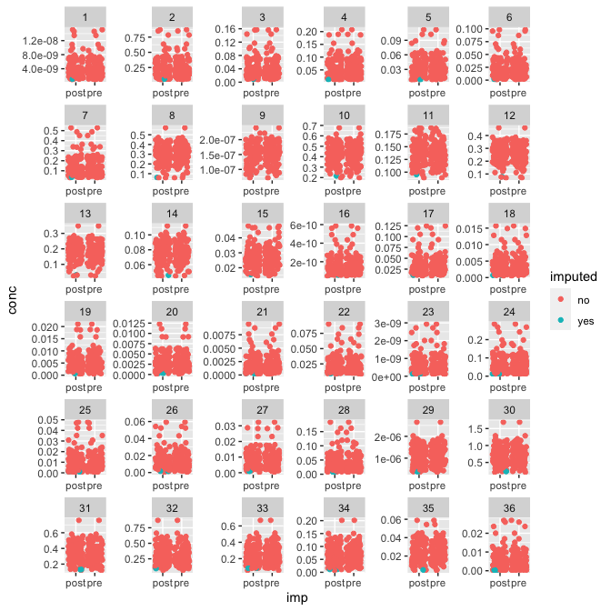
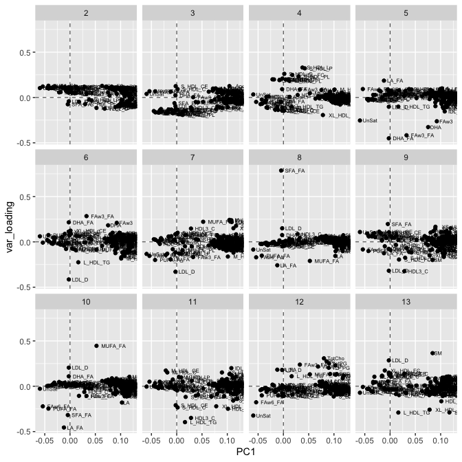

VIPVIZA-LPL
================

-   [Preprocessing](#preprocessing)
    -   [NMR](#nmr)
        -   [A. Pre-imputation
            diagnostics](#a.-pre-imputation-diagnostics)
        -   [B. Post-imputation
            diagnostics](#b.-post-imputation-diagnostics)
        -   [C. Outlier analysis](#c.-outlier-analysis)
-   [Session info](#session-info)

# Preprocessing

## NMR

### A. Pre-imputation diagnostics

Percent missing:

    ## [1] 117  22

    ##          ID    M_VLDL_P    M_VLDL_L   M_VLDL_PL    M_VLDL_C   M_VLDL_CE 
    ##   0.0000000   0.0000000   0.0000000   0.0000000   0.0000000   0.0000000 
    ##   M_VLDL_FC   M_VLDL_TG    S_VLDL_P    S_VLDL_L   S_VLDL_PL    S_VLDL_C 
    ##   0.0000000   0.0000000   0.0000000   0.0000000   0.0000000   0.0000000 
    ##   S_VLDL_CE   S_VLDL_FC   S_VLDL_TG   XS_VLDL_P   XS_VLDL_L  XS_VLDL_PL 
    ##   0.0000000   0.0000000   0.0000000   0.0000000   0.0000000   0.0000000 
    ##   XS_VLDL_C  XS_VLDL_CE  XS_VLDL_FC  XS_VLDL_TG       IDL_P       IDL_L 
    ##   0.0000000   0.0000000   0.0000000   0.0000000   0.0000000   0.0000000 
    ##      IDL_PL       IDL_C      IDL_CE      IDL_FC      IDL_TG     L_LDL_P 
    ##   0.0000000   0.0000000   0.0000000   0.0000000   0.0000000   0.0000000 
    ##     L_LDL_L    L_LDL_PL     L_LDL_C    L_LDL_CE    L_LDL_FC    L_LDL_TG 
    ##   0.0000000   0.0000000   0.0000000   0.0000000   0.0000000   0.0000000 
    ##     M_LDL_P     M_LDL_L    M_LDL_PL     M_LDL_C    M_LDL_FC    M_LDL_TG 
    ##   0.0000000   0.0000000   0.0000000   0.0000000   0.0000000   0.0000000 
    ##    XL_HDL_P    XL_HDL_L   XL_HDL_PL    XL_HDL_C   XL_HDL_CE   XL_HDL_FC 
    ##   0.0000000   0.0000000   0.0000000   0.0000000   0.0000000   0.0000000 
    ##   XL_HDL_TG     M_HDL_P     M_HDL_L    M_HDL_PL     M_HDL_C    M_HDL_CE 
    ##   0.0000000   0.0000000   0.0000000   0.0000000   0.0000000   0.0000000 
    ##    M_HDL_FC    M_HDL_TG     S_HDL_P     S_HDL_L    S_HDL_PL     S_HDL_C 
    ##   0.0000000   0.0000000   0.0000000   0.0000000   0.0000000   0.0000000 
    ##    S_HDL_CE    S_HDL_FC    S_HDL_TG      VLDL_D       LDL_D       HDL_D 
    ##   0.0000000   0.0000000   0.0000000   0.0000000   0.0000000   0.0000000 
    ##     Serum_C      VLDL_C   Remnant_C       LDL_C       HDL_C      HDL2_C 
    ##   0.0000000   0.0000000   0.0000000   0.0000000   0.0000000   0.0000000 
    ##      HDL3_C        EstC       FreeC    Serum_TG     VLDL_TG      LDL_TG 
    ##   0.0000000   0.0000000   0.0000000   0.0000000   0.0000000   0.0000000 
    ##      HDL_TG       TotPG       TG_PG          PC          SM      TotCho 
    ##   0.0000000   0.0000000   0.0000000   0.0000000   0.0000000   0.0000000 
    ##       ApoA1        ApoB  ApoB_ApoA1       TotFA       UnSat         DHA 
    ##   0.0000000   0.0000000   0.0000000   0.0000000   0.0000000   0.0000000 
    ##          LA        FAw3        FAw6        PUFA        MUFA         SFA 
    ##   0.0000000   0.0000000   0.0000000   0.0000000   0.0000000   0.0000000 
    ##      DHA_FA       LA_FA     FAw3_FA     FAw6_FA     PUFA_FA     MUFA_FA 
    ##   0.0000000   0.0000000   0.0000000   0.0000000   0.0000000   0.0000000 
    ##      SFA_FA    L_VLDL_P    L_VLDL_L   L_VLDL_PL    L_VLDL_C   L_VLDL_CE 
    ##   0.0000000   0.9090909   0.9090909   0.9090909   0.9090909   0.9090909 
    ##   L_VLDL_FC   L_VLDL_TG    M_LDL_CE     S_LDL_P     S_LDL_L    S_LDL_PL 
    ##   0.9090909   0.9090909   0.9090909   0.9090909   0.9090909   0.9090909 
    ##     S_LDL_C    S_LDL_CE    S_LDL_FC    S_LDL_TG  XXL_VLDL_P  XXL_VLDL_L 
    ##   0.9090909   0.9090909   0.9090909   0.9090909   1.8181818   1.8181818 
    ## XXL_VLDL_PL  XXL_VLDL_C XXL_VLDL_CE XXL_VLDL_FC XXL_VLDL_TG   XL_VLDL_P 
    ##   1.8181818   1.8181818   1.8181818   1.8181818   1.8181818   1.8181818 
    ##   XL_VLDL_L  XL_VLDL_PL   XL_VLDL_C  XL_VLDL_CE  XL_VLDL_TG     L_HDL_P 
    ##   1.8181818   1.8181818   1.8181818   1.8181818   1.8181818   1.8181818 
    ##     L_HDL_L    L_HDL_PL     L_HDL_C    L_HDL_CE    L_HDL_FC    L_HDL_TG 
    ##   1.8181818   1.8181818   1.8181818   1.8181818   1.8181818   1.8181818 
    ##  XL_VLDL_FC 
    ##   2.7272727

    ## $Main_bar
    ## TableGrob (12 x 9) "layout": 18 grobs
    ##     z         cells       name                                       grob
    ## 1   0 ( 1-12, 1- 9) background             rect[plot.background..rect.32]
    ## 2   5 ( 6- 6, 4- 4)     spacer                             zeroGrob[NULL]
    ## 3   7 ( 7- 7, 4- 4)     axis-l         absoluteGrob[GRID.absoluteGrob.22]
    ## 4   3 ( 8- 8, 4- 4)     spacer                             zeroGrob[NULL]
    ## 5   6 ( 6- 6, 5- 5)     axis-t                             zeroGrob[NULL]
    ## 6   1 ( 7- 7, 5- 5)      panel                    gTree[panel-1.gTree.16]
    ## 7   9 ( 8- 8, 5- 5)     axis-b         absoluteGrob[GRID.absoluteGrob.17]
    ## 8   4 ( 6- 6, 6- 6)     spacer                             zeroGrob[NULL]
    ## 9   8 ( 7- 7, 6- 6)     axis-r                             zeroGrob[NULL]
    ## 10  2 ( 8- 8, 6- 6)     spacer                             zeroGrob[NULL]
    ## 11 10 ( 5- 5, 5- 5)     xlab-t                             zeroGrob[NULL]
    ## 12 11 ( 9- 9, 5- 5)     xlab-b                             zeroGrob[NULL]
    ## 13 12 ( 7- 7, 3- 3)     ylab-l titleGrob[axis.title.y.left..titleGrob.26]
    ## 14 13 ( 7- 7, 7- 7)     ylab-r                             zeroGrob[NULL]
    ## 15 14 ( 4- 4, 5- 5)   subtitle       zeroGrob[plot.subtitle..zeroGrob.28]
    ## 16 15 ( 3- 3, 5- 5)      title          zeroGrob[plot.title..zeroGrob.27]
    ## 17 16 (10-10, 5- 5)    caption        zeroGrob[plot.caption..zeroGrob.30]
    ## 18 17 ( 2- 2, 2- 2)        tag            zeroGrob[plot.tag..zeroGrob.29]
    ## 
    ## $Matrix
    ## TableGrob (12 x 9) "layout": 18 grobs
    ##     z         cells       name                                       grob
    ## 1   0 ( 1-12, 1- 9) background             rect[plot.background..rect.63]
    ## 2   5 ( 6- 6, 4- 4)     spacer                             zeroGrob[NULL]
    ## 3   7 ( 7- 7, 4- 4)     axis-l         absoluteGrob[GRID.absoluteGrob.53]
    ## 4   3 ( 8- 8, 4- 4)     spacer                             zeroGrob[NULL]
    ## 5   6 ( 6- 6, 5- 5)     axis-t                             zeroGrob[NULL]
    ## 6   1 ( 7- 7, 5- 5)      panel                    gTree[panel-1.gTree.48]
    ## 7   9 ( 8- 8, 5- 5)     axis-b         absoluteGrob[GRID.absoluteGrob.49]
    ## 8   4 ( 6- 6, 6- 6)     spacer                             zeroGrob[NULL]
    ## 9   8 ( 7- 7, 6- 6)     axis-r                             zeroGrob[NULL]
    ## 10  2 ( 8- 8, 6- 6)     spacer                             zeroGrob[NULL]
    ## 11 10 ( 5- 5, 5- 5)     xlab-t                             zeroGrob[NULL]
    ## 12 11 ( 9- 9, 5- 5)     xlab-b                             zeroGrob[NULL]
    ## 13 12 ( 7- 7, 3- 3)     ylab-l titleGrob[axis.title.y.left..titleGrob.57]
    ## 14 13 ( 7- 7, 7- 7)     ylab-r                             zeroGrob[NULL]
    ## 15 14 ( 4- 4, 5- 5)   subtitle       zeroGrob[plot.subtitle..zeroGrob.59]
    ## 16 15 ( 3- 3, 5- 5)      title          zeroGrob[plot.title..zeroGrob.58]
    ## 17 16 (10-10, 5- 5)    caption        zeroGrob[plot.caption..zeroGrob.61]
    ## 18 17 ( 2- 2, 2- 2)        tag            zeroGrob[plot.tag..zeroGrob.60]
    ## 
    ## $Sizes
    ## TableGrob (12 x 9) "layout": 18 grobs
    ##     z         cells       name                                         grob
    ## 1   0 ( 1-12, 1- 9) background               rect[plot.background..rect.90]
    ## 2   5 ( 6- 6, 4- 4)     spacer                               zeroGrob[NULL]
    ## 3   7 ( 7- 7, 4- 4)     axis-l           absoluteGrob[GRID.absoluteGrob.81]
    ## 4   3 ( 8- 8, 4- 4)     spacer                               zeroGrob[NULL]
    ## 5   6 ( 6- 6, 5- 5)     axis-t                               zeroGrob[NULL]
    ## 6   1 ( 7- 7, 5- 5)      panel                      gTree[panel-1.gTree.75]
    ## 7   9 ( 8- 8, 5- 5)     axis-b           absoluteGrob[GRID.absoluteGrob.80]
    ## 8   4 ( 6- 6, 6- 6)     spacer                               zeroGrob[NULL]
    ## 9   8 ( 7- 7, 6- 6)     axis-r                               zeroGrob[NULL]
    ## 10  2 ( 8- 8, 6- 6)     spacer                               zeroGrob[NULL]
    ## 11 10 ( 5- 5, 5- 5)     xlab-t                               zeroGrob[NULL]
    ## 12 11 ( 9- 9, 5- 5)     xlab-b titleGrob[axis.title.x.bottom..titleGrob.84]
    ## 13 12 ( 7- 7, 3- 3)     ylab-l                               zeroGrob[NULL]
    ## 14 13 ( 7- 7, 7- 7)     ylab-r                               zeroGrob[NULL]
    ## 15 14 ( 4- 4, 5- 5)   subtitle         zeroGrob[plot.subtitle..zeroGrob.86]
    ## 16 15 ( 3- 3, 5- 5)      title            zeroGrob[plot.title..zeroGrob.85]
    ## 17 16 (10-10, 5- 5)    caption          zeroGrob[plot.caption..zeroGrob.88]
    ## 18 17 ( 2- 2, 2- 2)        tag              zeroGrob[plot.tag..zeroGrob.87]
    ## 
    ## $labels
    ## [1] "XL_VLDL_FC_NA" "L_HDL_TG_NA"   "L_HDL_FC_NA"   "L_HDL_CE_NA"  
    ## [5] "L_HDL_C_NA"   
    ## 
    ## $mb.ratio
    ## [1] 0.7 0.3
    ## 
    ## $att.x
    ## NULL
    ## 
    ## $att.y
    ## NULL
    ## 
    ## $New_data
    ##     ID_NA XL_VLDL_FC_NA L_HDL_C_NA L_HDL_CE_NA L_HDL_FC_NA L_HDL_TG_NA
    ## 1       0             0          0           0           0           0
    ## 2       0             1          0           0           0           0
    ## 3       0             0          0           0           0           0
    ## 4       0             0          0           0           0           0
    ## 5       0             0          0           0           0           0
    ## 6       0             0          0           0           0           0
    ## 7       0             0          0           0           0           0
    ## 8       0             0          0           0           0           0
    ## 9       0             0          0           0           0           0
    ## 10      0             0          0           0           0           0
    ## 11      0             0          0           0           0           0
    ## 12      0             0          0           0           0           0
    ## 13      0             0          0           0           0           0
    ## 14      0             0          0           0           0           0
    ## 15      0             0          0           0           0           0
    ## 16      0             0          0           0           0           0
    ## 17      0             0          0           0           0           0
    ## 18      0             0          0           0           0           0
    ## 19      0             0          0           0           0           0
    ## 20      0             0          0           0           0           0
    ## 21      0             0          0           0           0           0
    ## 22      0             0          0           0           0           0
    ## 23      0             0          0           0           0           0
    ## 24      0             0          0           0           0           0
    ## 25      0             0          0           0           0           0
    ## 26      0             0          0           0           0           0
    ## 27      0             0          0           0           0           0
    ## 28      0             0          0           0           0           0
    ## 29      0             0          0           0           0           0
    ## 30      0             0          0           0           0           0
    ## 31      0             0          0           0           0           0
    ## 32      0             0          0           0           0           0
    ## 33      0             0          0           0           0           0
    ## 34      0             0          0           0           0           0
    ## 35      0             0          0           0           0           0
    ## 36      0             0          0           0           0           0
    ## 37      0             0          0           0           0           0
    ## 38      0             0          0           0           0           0
    ## 39      0             0          0           0           0           0
    ## 40      0             0          0           0           0           0
    ## 41      0             0          0           0           0           0
    ## 42      0             0          0           0           0           0
    ## 43      0             0          0           0           0           0
    ## 44      0             0          0           0           0           0
    ## 45      0             0          0           0           0           0
    ## 46      0             0          0           0           0           0
    ## 47      0             0          0           0           0           0
    ## 48      0             0          0           0           0           0
    ## 49      0             0          0           0           0           0
    ## 50      0             0          0           0           0           0
    ## 51      0             0          0           0           0           0
    ## 52      0             0          0           0           0           0
    ## 53      0             0          0           0           0           0
    ## 54      0             0          0           0           0           0
    ## 55      0             0          0           0           0           0
    ## 56      0             0          0           0           0           0
    ## 57      0             0          0           0           0           0
    ## 58      0             0          0           0           0           0
    ## 59      0             0          0           0           0           0
    ## 60      0             0          0           0           0           0
    ## 61      0             0          0           0           0           0
    ## 62      0             0          1           1           1           1
    ## 63      0             0          0           0           0           0
    ## 64      0             0          0           0           0           0
    ## 65      0             0          0           0           0           0
    ## 66      0             0          0           0           0           0
    ## 67      0             0          0           0           0           0
    ## 68      0             0          0           0           0           0
    ## 69      0             0          0           0           0           0
    ## 70      0             0          0           0           0           0
    ## 71      0             0          0           0           0           0
    ## 72      0             0          0           0           0           0
    ## 73      0             0          0           0           0           0
    ## 74      0             0          0           0           0           0
    ## 75      0             0          0           0           0           0
    ## 76      0             0          0           0           0           0
    ## 77      0             0          0           0           0           0
    ## 78      0             0          0           0           0           0
    ## 79      0             0          0           0           0           0
    ## 80      0             0          0           0           0           0
    ## 81      0             0          0           0           0           0
    ## 82      0             0          0           0           0           0
    ## 83      0             0          0           0           0           0
    ## 84      0             0          0           0           0           0
    ## 85      0             0          0           0           0           0
    ## 86      0             0          0           0           0           0
    ## 87      0             0          0           0           0           0
    ## 88      0             0          0           0           0           0
    ## 89      0             0          0           0           0           0
    ## 90      0             0          0           0           0           0
    ## 91      0             0          0           0           0           0
    ## 92      0             0          0           0           0           0
    ## 93      0             0          0           0           0           0
    ## 94      0             0          0           0           0           0
    ## 95      0             0          0           0           0           0
    ## 96      0             1          0           0           0           0
    ## 97      0             0          0           0           0           0
    ## 98      0             1          0           0           0           0
    ## 99      0             0          1           1           1           1
    ## 100     0             0          0           0           0           0
    ## 101     0             0          0           0           0           0
    ## 102     0             0          0           0           0           0
    ## 103     0             0          0           0           0           0
    ## 104     0             0          0           0           0           0
    ## 105     0             0          0           0           0           0
    ## 106     0             0          0           0           0           0
    ## 107     0             0          0           0           0           0
    ## 108     0             0          0           0           0           0
    ## 109     0             0          0           0           0           0
    ## 110     0             0          0           0           0           0
    ##     M_HDL_P_NA M_HDL_L_NA M_HDL_PL_NA M_HDL_C_NA M_HDL_CE_NA M_HDL_FC_NA
    ## 1            0          0           0          0           0           0
    ## 2            0          0           0          0           0           0
    ## 3            0          0           0          0           0           0
    ## 4            0          0           0          0           0           0
    ## 5            0          0           0          0           0           0
    ## 6            0          0           0          0           0           0
    ## 7            0          0           0          0           0           0
    ## 8            0          0           0          0           0           0
    ## 9            0          0           0          0           0           0
    ## 10           0          0           0          0           0           0
    ## 11           0          0           0          0           0           0
    ## 12           0          0           0          0           0           0
    ## 13           0          0           0          0           0           0
    ## 14           0          0           0          0           0           0
    ## 15           0          0           0          0           0           0
    ## 16           0          0           0          0           0           0
    ## 17           0          0           0          0           0           0
    ## 18           0          0           0          0           0           0
    ## 19           0          0           0          0           0           0
    ## 20           0          0           0          0           0           0
    ## 21           0          0           0          0           0           0
    ## 22           0          0           0          0           0           0
    ## 23           0          0           0          0           0           0
    ## 24           0          0           0          0           0           0
    ## 25           0          0           0          0           0           0
    ## 26           0          0           0          0           0           0
    ## 27           0          0           0          0           0           0
    ## 28           0          0           0          0           0           0
    ## 29           0          0           0          0           0           0
    ## 30           0          0           0          0           0           0
    ## 31           0          0           0          0           0           0
    ## 32           0          0           0          0           0           0
    ## 33           0          0           0          0           0           0
    ## 34           0          0           0          0           0           0
    ## 35           0          0           0          0           0           0
    ## 36           0          0           0          0           0           0
    ## 37           0          0           0          0           0           0
    ## 38           0          0           0          0           0           0
    ## 39           0          0           0          0           0           0
    ## 40           0          0           0          0           0           0
    ## 41           0          0           0          0           0           0
    ## 42           0          0           0          0           0           0
    ## 43           0          0           0          0           0           0
    ## 44           0          0           0          0           0           0
    ## 45           0          0           0          0           0           0
    ## 46           0          0           0          0           0           0
    ## 47           0          0           0          0           0           0
    ## 48           0          0           0          0           0           0
    ## 49           0          0           0          0           0           0
    ## 50           0          0           0          0           0           0
    ## 51           0          0           0          0           0           0
    ## 52           0          0           0          0           0           0
    ## 53           0          0           0          0           0           0
    ## 54           0          0           0          0           0           0
    ## 55           0          0           0          0           0           0
    ## 56           0          0           0          0           0           0
    ## 57           0          0           0          0           0           0
    ## 58           0          0           0          0           0           0
    ## 59           0          0           0          0           0           0
    ## 60           0          0           0          0           0           0
    ## 61           0          0           0          0           0           0
    ## 62           0          0           0          0           0           0
    ## 63           0          0           0          0           0           0
    ## 64           0          0           0          0           0           0
    ## 65           0          0           0          0           0           0
    ## 66           0          0           0          0           0           0
    ## 67           0          0           0          0           0           0
    ## 68           0          0           0          0           0           0
    ## 69           0          0           0          0           0           0
    ## 70           0          0           0          0           0           0
    ## 71           0          0           0          0           0           0
    ## 72           0          0           0          0           0           0
    ## 73           0          0           0          0           0           0
    ## 74           0          0           0          0           0           0
    ## 75           0          0           0          0           0           0
    ## 76           0          0           0          0           0           0
    ## 77           0          0           0          0           0           0
    ## 78           0          0           0          0           0           0
    ## 79           0          0           0          0           0           0
    ## 80           0          0           0          0           0           0
    ## 81           0          0           0          0           0           0
    ## 82           0          0           0          0           0           0
    ## 83           0          0           0          0           0           0
    ## 84           0          0           0          0           0           0
    ## 85           0          0           0          0           0           0
    ## 86           0          0           0          0           0           0
    ## 87           0          0           0          0           0           0
    ## 88           0          0           0          0           0           0
    ## 89           0          0           0          0           0           0
    ## 90           0          0           0          0           0           0
    ## 91           0          0           0          0           0           0
    ## 92           0          0           0          0           0           0
    ## 93           0          0           0          0           0           0
    ## 94           0          0           0          0           0           0
    ## 95           0          0           0          0           0           0
    ## 96           0          0           0          0           0           0
    ## 97           0          0           0          0           0           0
    ## 98           0          0           0          0           0           0
    ## 99           0          0           0          0           0           0
    ## 100          0          0           0          0           0           0
    ## 101          0          0           0          0           0           0
    ## 102          0          0           0          0           0           0
    ## 103          0          0           0          0           0           0
    ## 104          0          0           0          0           0           0
    ## 105          0          0           0          0           0           0
    ## 106          0          0           0          0           0           0
    ## 107          0          0           0          0           0           0
    ## 108          0          0           0          0           0           0
    ## 109          0          0           0          0           0           0
    ## 110          0          0           0          0           0           0
    ##     M_HDL_TG_NA S_HDL_P_NA S_HDL_L_NA S_HDL_PL_NA S_HDL_C_NA S_HDL_CE_NA
    ## 1             0          0          0           0          0           0
    ## 2             0          0          0           0          0           0
    ## 3             0          0          0           0          0           0
    ## 4             0          0          0           0          0           0
    ## 5             0          0          0           0          0           0
    ## 6             0          0          0           0          0           0
    ## 7             0          0          0           0          0           0
    ## 8             0          0          0           0          0           0
    ## 9             0          0          0           0          0           0
    ## 10            0          0          0           0          0           0
    ## 11            0          0          0           0          0           0
    ## 12            0          0          0           0          0           0
    ## 13            0          0          0           0          0           0
    ## 14            0          0          0           0          0           0
    ## 15            0          0          0           0          0           0
    ## 16            0          0          0           0          0           0
    ## 17            0          0          0           0          0           0
    ## 18            0          0          0           0          0           0
    ## 19            0          0          0           0          0           0
    ## 20            0          0          0           0          0           0
    ## 21            0          0          0           0          0           0
    ## 22            0          0          0           0          0           0
    ## 23            0          0          0           0          0           0
    ## 24            0          0          0           0          0           0
    ## 25            0          0          0           0          0           0
    ## 26            0          0          0           0          0           0
    ## 27            0          0          0           0          0           0
    ## 28            0          0          0           0          0           0
    ## 29            0          0          0           0          0           0
    ## 30            0          0          0           0          0           0
    ## 31            0          0          0           0          0           0
    ## 32            0          0          0           0          0           0
    ## 33            0          0          0           0          0           0
    ## 34            0          0          0           0          0           0
    ## 35            0          0          0           0          0           0
    ## 36            0          0          0           0          0           0
    ## 37            0          0          0           0          0           0
    ## 38            0          0          0           0          0           0
    ## 39            0          0          0           0          0           0
    ## 40            0          0          0           0          0           0
    ## 41            0          0          0           0          0           0
    ## 42            0          0          0           0          0           0
    ## 43            0          0          0           0          0           0
    ## 44            0          0          0           0          0           0
    ## 45            0          0          0           0          0           0
    ## 46            0          0          0           0          0           0
    ## 47            0          0          0           0          0           0
    ## 48            0          0          0           0          0           0
    ## 49            0          0          0           0          0           0
    ## 50            0          0          0           0          0           0
    ## 51            0          0          0           0          0           0
    ## 52            0          0          0           0          0           0
    ## 53            0          0          0           0          0           0
    ## 54            0          0          0           0          0           0
    ## 55            0          0          0           0          0           0
    ## 56            0          0          0           0          0           0
    ## 57            0          0          0           0          0           0
    ## 58            0          0          0           0          0           0
    ## 59            0          0          0           0          0           0
    ## 60            0          0          0           0          0           0
    ## 61            0          0          0           0          0           0
    ## 62            0          0          0           0          0           0
    ## 63            0          0          0           0          0           0
    ## 64            0          0          0           0          0           0
    ## 65            0          0          0           0          0           0
    ## 66            0          0          0           0          0           0
    ## 67            0          0          0           0          0           0
    ## 68            0          0          0           0          0           0
    ## 69            0          0          0           0          0           0
    ## 70            0          0          0           0          0           0
    ## 71            0          0          0           0          0           0
    ## 72            0          0          0           0          0           0
    ## 73            0          0          0           0          0           0
    ## 74            0          0          0           0          0           0
    ## 75            0          0          0           0          0           0
    ## 76            0          0          0           0          0           0
    ## 77            0          0          0           0          0           0
    ## 78            0          0          0           0          0           0
    ## 79            0          0          0           0          0           0
    ## 80            0          0          0           0          0           0
    ## 81            0          0          0           0          0           0
    ## 82            0          0          0           0          0           0
    ## 83            0          0          0           0          0           0
    ## 84            0          0          0           0          0           0
    ## 85            0          0          0           0          0           0
    ## 86            0          0          0           0          0           0
    ## 87            0          0          0           0          0           0
    ## 88            0          0          0           0          0           0
    ## 89            0          0          0           0          0           0
    ## 90            0          0          0           0          0           0
    ## 91            0          0          0           0          0           0
    ## 92            0          0          0           0          0           0
    ## 93            0          0          0           0          0           0
    ## 94            0          0          0           0          0           0
    ## 95            0          0          0           0          0           0
    ## 96            0          0          0           0          0           0
    ## 97            0          0          0           0          0           0
    ## 98            0          0          0           0          0           0
    ## 99            0          0          0           0          0           0
    ## 100           0          0          0           0          0           0
    ## 101           0          0          0           0          0           0
    ## 102           0          0          0           0          0           0
    ## 103           0          0          0           0          0           0
    ## 104           0          0          0           0          0           0
    ## 105           0          0          0           0          0           0
    ## 106           0          0          0           0          0           0
    ## 107           0          0          0           0          0           0
    ## 108           0          0          0           0          0           0
    ## 109           0          0          0           0          0           0
    ## 110           0          0          0           0          0           0
    ##     S_HDL_FC_NA S_HDL_TG_NA VLDL_D_NA LDL_D_NA HDL_D_NA Serum_C_NA VLDL_C_NA
    ## 1             0           0         0        0        0          0         0
    ## 2             0           0         0        0        0          0         0
    ## 3             0           0         0        0        0          0         0
    ## 4             0           0         0        0        0          0         0
    ## 5             0           0         0        0        0          0         0
    ## 6             0           0         0        0        0          0         0
    ## 7             0           0         0        0        0          0         0
    ## 8             0           0         0        0        0          0         0
    ## 9             0           0         0        0        0          0         0
    ## 10            0           0         0        0        0          0         0
    ## 11            0           0         0        0        0          0         0
    ## 12            0           0         0        0        0          0         0
    ## 13            0           0         0        0        0          0         0
    ## 14            0           0         0        0        0          0         0
    ## 15            0           0         0        0        0          0         0
    ## 16            0           0         0        0        0          0         0
    ## 17            0           0         0        0        0          0         0
    ## 18            0           0         0        0        0          0         0
    ## 19            0           0         0        0        0          0         0
    ## 20            0           0         0        0        0          0         0
    ## 21            0           0         0        0        0          0         0
    ## 22            0           0         0        0        0          0         0
    ## 23            0           0         0        0        0          0         0
    ## 24            0           0         0        0        0          0         0
    ## 25            0           0         0        0        0          0         0
    ## 26            0           0         0        0        0          0         0
    ## 27            0           0         0        0        0          0         0
    ## 28            0           0         0        0        0          0         0
    ## 29            0           0         0        0        0          0         0
    ## 30            0           0         0        0        0          0         0
    ## 31            0           0         0        0        0          0         0
    ## 32            0           0         0        0        0          0         0
    ## 33            0           0         0        0        0          0         0
    ## 34            0           0         0        0        0          0         0
    ## 35            0           0         0        0        0          0         0
    ## 36            0           0         0        0        0          0         0
    ## 37            0           0         0        0        0          0         0
    ## 38            0           0         0        0        0          0         0
    ## 39            0           0         0        0        0          0         0
    ## 40            0           0         0        0        0          0         0
    ## 41            0           0         0        0        0          0         0
    ## 42            0           0         0        0        0          0         0
    ## 43            0           0         0        0        0          0         0
    ## 44            0           0         0        0        0          0         0
    ## 45            0           0         0        0        0          0         0
    ## 46            0           0         0        0        0          0         0
    ## 47            0           0         0        0        0          0         0
    ## 48            0           0         0        0        0          0         0
    ## 49            0           0         0        0        0          0         0
    ## 50            0           0         0        0        0          0         0
    ## 51            0           0         0        0        0          0         0
    ## 52            0           0         0        0        0          0         0
    ## 53            0           0         0        0        0          0         0
    ## 54            0           0         0        0        0          0         0
    ## 55            0           0         0        0        0          0         0
    ## 56            0           0         0        0        0          0         0
    ## 57            0           0         0        0        0          0         0
    ## 58            0           0         0        0        0          0         0
    ## 59            0           0         0        0        0          0         0
    ## 60            0           0         0        0        0          0         0
    ## 61            0           0         0        0        0          0         0
    ## 62            0           0         0        0        0          0         0
    ## 63            0           0         0        0        0          0         0
    ## 64            0           0         0        0        0          0         0
    ## 65            0           0         0        0        0          0         0
    ## 66            0           0         0        0        0          0         0
    ## 67            0           0         0        0        0          0         0
    ## 68            0           0         0        0        0          0         0
    ## 69            0           0         0        0        0          0         0
    ## 70            0           0         0        0        0          0         0
    ## 71            0           0         0        0        0          0         0
    ## 72            0           0         0        0        0          0         0
    ## 73            0           0         0        0        0          0         0
    ## 74            0           0         0        0        0          0         0
    ## 75            0           0         0        0        0          0         0
    ## 76            0           0         0        0        0          0         0
    ## 77            0           0         0        0        0          0         0
    ## 78            0           0         0        0        0          0         0
    ## 79            0           0         0        0        0          0         0
    ## 80            0           0         0        0        0          0         0
    ## 81            0           0         0        0        0          0         0
    ## 82            0           0         0        0        0          0         0
    ## 83            0           0         0        0        0          0         0
    ## 84            0           0         0        0        0          0         0
    ## 85            0           0         0        0        0          0         0
    ## 86            0           0         0        0        0          0         0
    ## 87            0           0         0        0        0          0         0
    ## 88            0           0         0        0        0          0         0
    ## 89            0           0         0        0        0          0         0
    ## 90            0           0         0        0        0          0         0
    ## 91            0           0         0        0        0          0         0
    ## 92            0           0         0        0        0          0         0
    ## 93            0           0         0        0        0          0         0
    ## 94            0           0         0        0        0          0         0
    ## 95            0           0         0        0        0          0         0
    ## 96            0           0         0        0        0          0         0
    ## 97            0           0         0        0        0          0         0
    ## 98            0           0         0        0        0          0         0
    ## 99            0           0         0        0        0          0         0
    ## 100           0           0         0        0        0          0         0
    ## 101           0           0         0        0        0          0         0
    ## 102           0           0         0        0        0          0         0
    ## 103           0           0         0        0        0          0         0
    ## 104           0           0         0        0        0          0         0
    ## 105           0           0         0        0        0          0         0
    ## 106           0           0         0        0        0          0         0
    ## 107           0           0         0        0        0          0         0
    ## 108           0           0         0        0        0          0         0
    ## 109           0           0         0        0        0          0         0
    ## 110           0           0         0        0        0          0         0
    ##     Remnant_C_NA LDL_C_NA HDL_C_NA HDL2_C_NA HDL3_C_NA EstC_NA FreeC_NA
    ## 1              0        0        0         0         0       0        0
    ## 2              0        0        0         0         0       0        0
    ## 3              0        0        0         0         0       0        0
    ## 4              0        0        0         0         0       0        0
    ## 5              0        0        0         0         0       0        0
    ## 6              0        0        0         0         0       0        0
    ## 7              0        0        0         0         0       0        0
    ## 8              0        0        0         0         0       0        0
    ## 9              0        0        0         0         0       0        0
    ## 10             0        0        0         0         0       0        0
    ## 11             0        0        0         0         0       0        0
    ## 12             0        0        0         0         0       0        0
    ## 13             0        0        0         0         0       0        0
    ## 14             0        0        0         0         0       0        0
    ## 15             0        0        0         0         0       0        0
    ## 16             0        0        0         0         0       0        0
    ## 17             0        0        0         0         0       0        0
    ## 18             0        0        0         0         0       0        0
    ## 19             0        0        0         0         0       0        0
    ## 20             0        0        0         0         0       0        0
    ## 21             0        0        0         0         0       0        0
    ## 22             0        0        0         0         0       0        0
    ## 23             0        0        0         0         0       0        0
    ## 24             0        0        0         0         0       0        0
    ## 25             0        0        0         0         0       0        0
    ## 26             0        0        0         0         0       0        0
    ## 27             0        0        0         0         0       0        0
    ## 28             0        0        0         0         0       0        0
    ## 29             0        0        0         0         0       0        0
    ## 30             0        0        0         0         0       0        0
    ## 31             0        0        0         0         0       0        0
    ## 32             0        0        0         0         0       0        0
    ## 33             0        0        0         0         0       0        0
    ## 34             0        0        0         0         0       0        0
    ## 35             0        0        0         0         0       0        0
    ## 36             0        0        0         0         0       0        0
    ## 37             0        0        0         0         0       0        0
    ## 38             0        0        0         0         0       0        0
    ## 39             0        0        0         0         0       0        0
    ## 40             0        0        0         0         0       0        0
    ## 41             0        0        0         0         0       0        0
    ## 42             0        0        0         0         0       0        0
    ## 43             0        0        0         0         0       0        0
    ## 44             0        0        0         0         0       0        0
    ## 45             0        0        0         0         0       0        0
    ## 46             0        0        0         0         0       0        0
    ## 47             0        0        0         0         0       0        0
    ## 48             0        0        0         0         0       0        0
    ## 49             0        0        0         0         0       0        0
    ## 50             0        0        0         0         0       0        0
    ## 51             0        0        0         0         0       0        0
    ## 52             0        0        0         0         0       0        0
    ## 53             0        0        0         0         0       0        0
    ## 54             0        0        0         0         0       0        0
    ## 55             0        0        0         0         0       0        0
    ## 56             0        0        0         0         0       0        0
    ## 57             0        0        0         0         0       0        0
    ## 58             0        0        0         0         0       0        0
    ## 59             0        0        0         0         0       0        0
    ## 60             0        0        0         0         0       0        0
    ## 61             0        0        0         0         0       0        0
    ## 62             0        0        0         0         0       0        0
    ## 63             0        0        0         0         0       0        0
    ## 64             0        0        0         0         0       0        0
    ## 65             0        0        0         0         0       0        0
    ## 66             0        0        0         0         0       0        0
    ## 67             0        0        0         0         0       0        0
    ## 68             0        0        0         0         0       0        0
    ## 69             0        0        0         0         0       0        0
    ## 70             0        0        0         0         0       0        0
    ## 71             0        0        0         0         0       0        0
    ## 72             0        0        0         0         0       0        0
    ## 73             0        0        0         0         0       0        0
    ## 74             0        0        0         0         0       0        0
    ## 75             0        0        0         0         0       0        0
    ## 76             0        0        0         0         0       0        0
    ## 77             0        0        0         0         0       0        0
    ## 78             0        0        0         0         0       0        0
    ## 79             0        0        0         0         0       0        0
    ## 80             0        0        0         0         0       0        0
    ## 81             0        0        0         0         0       0        0
    ## 82             0        0        0         0         0       0        0
    ## 83             0        0        0         0         0       0        0
    ## 84             0        0        0         0         0       0        0
    ## 85             0        0        0         0         0       0        0
    ## 86             0        0        0         0         0       0        0
    ## 87             0        0        0         0         0       0        0
    ## 88             0        0        0         0         0       0        0
    ## 89             0        0        0         0         0       0        0
    ## 90             0        0        0         0         0       0        0
    ## 91             0        0        0         0         0       0        0
    ## 92             0        0        0         0         0       0        0
    ## 93             0        0        0         0         0       0        0
    ## 94             0        0        0         0         0       0        0
    ## 95             0        0        0         0         0       0        0
    ## 96             0        0        0         0         0       0        0
    ## 97             0        0        0         0         0       0        0
    ## 98             0        0        0         0         0       0        0
    ## 99             0        0        0         0         0       0        0
    ## 100            0        0        0         0         0       0        0
    ## 101            0        0        0         0         0       0        0
    ## 102            0        0        0         0         0       0        0
    ## 103            0        0        0         0         0       0        0
    ## 104            0        0        0         0         0       0        0
    ## 105            0        0        0         0         0       0        0
    ## 106            0        0        0         0         0       0        0
    ## 107            0        0        0         0         0       0        0
    ## 108            0        0        0         0         0       0        0
    ## 109            0        0        0         0         0       0        0
    ## 110            0        0        0         0         0       0        0
    ##     Serum_TG_NA VLDL_TG_NA LDL_TG_NA HDL_TG_NA TotPG_NA TG_PG_NA PC_NA SM_NA
    ## 1             0          0         0         0        0        0     0     0
    ## 2             0          0         0         0        0        0     0     0
    ## 3             0          0         0         0        0        0     0     0
    ## 4             0          0         0         0        0        0     0     0
    ## 5             0          0         0         0        0        0     0     0
    ## 6             0          0         0         0        0        0     0     0
    ## 7             0          0         0         0        0        0     0     0
    ## 8             0          0         0         0        0        0     0     0
    ## 9             0          0         0         0        0        0     0     0
    ## 10            0          0         0         0        0        0     0     0
    ## 11            0          0         0         0        0        0     0     0
    ## 12            0          0         0         0        0        0     0     0
    ## 13            0          0         0         0        0        0     0     0
    ## 14            0          0         0         0        0        0     0     0
    ## 15            0          0         0         0        0        0     0     0
    ## 16            0          0         0         0        0        0     0     0
    ## 17            0          0         0         0        0        0     0     0
    ## 18            0          0         0         0        0        0     0     0
    ## 19            0          0         0         0        0        0     0     0
    ## 20            0          0         0         0        0        0     0     0
    ## 21            0          0         0         0        0        0     0     0
    ## 22            0          0         0         0        0        0     0     0
    ## 23            0          0         0         0        0        0     0     0
    ## 24            0          0         0         0        0        0     0     0
    ## 25            0          0         0         0        0        0     0     0
    ## 26            0          0         0         0        0        0     0     0
    ## 27            0          0         0         0        0        0     0     0
    ## 28            0          0         0         0        0        0     0     0
    ## 29            0          0         0         0        0        0     0     0
    ## 30            0          0         0         0        0        0     0     0
    ## 31            0          0         0         0        0        0     0     0
    ## 32            0          0         0         0        0        0     0     0
    ## 33            0          0         0         0        0        0     0     0
    ## 34            0          0         0         0        0        0     0     0
    ## 35            0          0         0         0        0        0     0     0
    ## 36            0          0         0         0        0        0     0     0
    ## 37            0          0         0         0        0        0     0     0
    ## 38            0          0         0         0        0        0     0     0
    ## 39            0          0         0         0        0        0     0     0
    ## 40            0          0         0         0        0        0     0     0
    ## 41            0          0         0         0        0        0     0     0
    ## 42            0          0         0         0        0        0     0     0
    ## 43            0          0         0         0        0        0     0     0
    ## 44            0          0         0         0        0        0     0     0
    ## 45            0          0         0         0        0        0     0     0
    ## 46            0          0         0         0        0        0     0     0
    ## 47            0          0         0         0        0        0     0     0
    ## 48            0          0         0         0        0        0     0     0
    ## 49            0          0         0         0        0        0     0     0
    ## 50            0          0         0         0        0        0     0     0
    ## 51            0          0         0         0        0        0     0     0
    ## 52            0          0         0         0        0        0     0     0
    ## 53            0          0         0         0        0        0     0     0
    ## 54            0          0         0         0        0        0     0     0
    ## 55            0          0         0         0        0        0     0     0
    ## 56            0          0         0         0        0        0     0     0
    ## 57            0          0         0         0        0        0     0     0
    ## 58            0          0         0         0        0        0     0     0
    ## 59            0          0         0         0        0        0     0     0
    ## 60            0          0         0         0        0        0     0     0
    ## 61            0          0         0         0        0        0     0     0
    ## 62            0          0         0         0        0        0     0     0
    ## 63            0          0         0         0        0        0     0     0
    ## 64            0          0         0         0        0        0     0     0
    ## 65            0          0         0         0        0        0     0     0
    ## 66            0          0         0         0        0        0     0     0
    ## 67            0          0         0         0        0        0     0     0
    ## 68            0          0         0         0        0        0     0     0
    ## 69            0          0         0         0        0        0     0     0
    ## 70            0          0         0         0        0        0     0     0
    ## 71            0          0         0         0        0        0     0     0
    ## 72            0          0         0         0        0        0     0     0
    ## 73            0          0         0         0        0        0     0     0
    ## 74            0          0         0         0        0        0     0     0
    ## 75            0          0         0         0        0        0     0     0
    ## 76            0          0         0         0        0        0     0     0
    ## 77            0          0         0         0        0        0     0     0
    ## 78            0          0         0         0        0        0     0     0
    ## 79            0          0         0         0        0        0     0     0
    ## 80            0          0         0         0        0        0     0     0
    ## 81            0          0         0         0        0        0     0     0
    ## 82            0          0         0         0        0        0     0     0
    ## 83            0          0         0         0        0        0     0     0
    ## 84            0          0         0         0        0        0     0     0
    ## 85            0          0         0         0        0        0     0     0
    ## 86            0          0         0         0        0        0     0     0
    ## 87            0          0         0         0        0        0     0     0
    ## 88            0          0         0         0        0        0     0     0
    ## 89            0          0         0         0        0        0     0     0
    ## 90            0          0         0         0        0        0     0     0
    ## 91            0          0         0         0        0        0     0     0
    ## 92            0          0         0         0        0        0     0     0
    ## 93            0          0         0         0        0        0     0     0
    ## 94            0          0         0         0        0        0     0     0
    ## 95            0          0         0         0        0        0     0     0
    ## 96            0          0         0         0        0        0     0     0
    ## 97            0          0         0         0        0        0     0     0
    ## 98            0          0         0         0        0        0     0     0
    ## 99            0          0         0         0        0        0     0     0
    ## 100           0          0         0         0        0        0     0     0
    ## 101           0          0         0         0        0        0     0     0
    ## 102           0          0         0         0        0        0     0     0
    ## 103           0          0         0         0        0        0     0     0
    ## 104           0          0         0         0        0        0     0     0
    ## 105           0          0         0         0        0        0     0     0
    ## 106           0          0         0         0        0        0     0     0
    ## 107           0          0         0         0        0        0     0     0
    ## 108           0          0         0         0        0        0     0     0
    ## 109           0          0         0         0        0        0     0     0
    ## 110           0          0         0         0        0        0     0     0
    ##     TotCho_NA ApoA1_NA ApoB_NA ApoB_ApoA1_NA TotFA_NA UnSat_NA DHA_NA LA_NA
    ## 1           0        0       0             0        0        0      0     0
    ## 2           0        0       0             0        0        0      0     0
    ## 3           0        0       0             0        0        0      0     0
    ## 4           0        0       0             0        0        0      0     0
    ## 5           0        0       0             0        0        0      0     0
    ## 6           0        0       0             0        0        0      0     0
    ## 7           0        0       0             0        0        0      0     0
    ## 8           0        0       0             0        0        0      0     0
    ## 9           0        0       0             0        0        0      0     0
    ## 10          0        0       0             0        0        0      0     0
    ## 11          0        0       0             0        0        0      0     0
    ## 12          0        0       0             0        0        0      0     0
    ## 13          0        0       0             0        0        0      0     0
    ## 14          0        0       0             0        0        0      0     0
    ## 15          0        0       0             0        0        0      0     0
    ## 16          0        0       0             0        0        0      0     0
    ## 17          0        0       0             0        0        0      0     0
    ## 18          0        0       0             0        0        0      0     0
    ## 19          0        0       0             0        0        0      0     0
    ## 20          0        0       0             0        0        0      0     0
    ## 21          0        0       0             0        0        0      0     0
    ## 22          0        0       0             0        0        0      0     0
    ## 23          0        0       0             0        0        0      0     0
    ## 24          0        0       0             0        0        0      0     0
    ## 25          0        0       0             0        0        0      0     0
    ## 26          0        0       0             0        0        0      0     0
    ## 27          0        0       0             0        0        0      0     0
    ## 28          0        0       0             0        0        0      0     0
    ## 29          0        0       0             0        0        0      0     0
    ## 30          0        0       0             0        0        0      0     0
    ## 31          0        0       0             0        0        0      0     0
    ## 32          0        0       0             0        0        0      0     0
    ## 33          0        0       0             0        0        0      0     0
    ## 34          0        0       0             0        0        0      0     0
    ## 35          0        0       0             0        0        0      0     0
    ## 36          0        0       0             0        0        0      0     0
    ## 37          0        0       0             0        0        0      0     0
    ## 38          0        0       0             0        0        0      0     0
    ## 39          0        0       0             0        0        0      0     0
    ## 40          0        0       0             0        0        0      0     0
    ## 41          0        0       0             0        0        0      0     0
    ## 42          0        0       0             0        0        0      0     0
    ## 43          0        0       0             0        0        0      0     0
    ## 44          0        0       0             0        0        0      0     0
    ## 45          0        0       0             0        0        0      0     0
    ## 46          0        0       0             0        0        0      0     0
    ## 47          0        0       0             0        0        0      0     0
    ## 48          0        0       0             0        0        0      0     0
    ## 49          0        0       0             0        0        0      0     0
    ## 50          0        0       0             0        0        0      0     0
    ## 51          0        0       0             0        0        0      0     0
    ## 52          0        0       0             0        0        0      0     0
    ## 53          0        0       0             0        0        0      0     0
    ## 54          0        0       0             0        0        0      0     0
    ## 55          0        0       0             0        0        0      0     0
    ## 56          0        0       0             0        0        0      0     0
    ## 57          0        0       0             0        0        0      0     0
    ## 58          0        0       0             0        0        0      0     0
    ## 59          0        0       0             0        0        0      0     0
    ## 60          0        0       0             0        0        0      0     0
    ## 61          0        0       0             0        0        0      0     0
    ## 62          0        0       0             0        0        0      0     0
    ## 63          0        0       0             0        0        0      0     0
    ## 64          0        0       0             0        0        0      0     0
    ## 65          0        0       0             0        0        0      0     0
    ## 66          0        0       0             0        0        0      0     0
    ## 67          0        0       0             0        0        0      0     0
    ## 68          0        0       0             0        0        0      0     0
    ## 69          0        0       0             0        0        0      0     0
    ## 70          0        0       0             0        0        0      0     0
    ## 71          0        0       0             0        0        0      0     0
    ## 72          0        0       0             0        0        0      0     0
    ## 73          0        0       0             0        0        0      0     0
    ## 74          0        0       0             0        0        0      0     0
    ## 75          0        0       0             0        0        0      0     0
    ## 76          0        0       0             0        0        0      0     0
    ## 77          0        0       0             0        0        0      0     0
    ## 78          0        0       0             0        0        0      0     0
    ## 79          0        0       0             0        0        0      0     0
    ## 80          0        0       0             0        0        0      0     0
    ## 81          0        0       0             0        0        0      0     0
    ## 82          0        0       0             0        0        0      0     0
    ## 83          0        0       0             0        0        0      0     0
    ## 84          0        0       0             0        0        0      0     0
    ## 85          0        0       0             0        0        0      0     0
    ## 86          0        0       0             0        0        0      0     0
    ## 87          0        0       0             0        0        0      0     0
    ## 88          0        0       0             0        0        0      0     0
    ## 89          0        0       0             0        0        0      0     0
    ## 90          0        0       0             0        0        0      0     0
    ## 91          0        0       0             0        0        0      0     0
    ## 92          0        0       0             0        0        0      0     0
    ## 93          0        0       0             0        0        0      0     0
    ## 94          0        0       0             0        0        0      0     0
    ## 95          0        0       0             0        0        0      0     0
    ## 96          0        0       0             0        0        0      0     0
    ## 97          0        0       0             0        0        0      0     0
    ## 98          0        0       0             0        0        0      0     0
    ## 99          0        0       0             0        0        0      0     0
    ## 100         0        0       0             0        0        0      0     0
    ## 101         0        0       0             0        0        0      0     0
    ## 102         0        0       0             0        0        0      0     0
    ## 103         0        0       0             0        0        0      0     0
    ## 104         0        0       0             0        0        0      0     0
    ## 105         0        0       0             0        0        0      0     0
    ## 106         0        0       0             0        0        0      0     0
    ## 107         0        0       0             0        0        0      0     0
    ## 108         0        0       0             0        0        0      0     0
    ## 109         0        0       0             0        0        0      0     0
    ## 110         0        0       0             0        0        0      0     0
    ##     FAw3_NA FAw6_NA PUFA_NA MUFA_NA SFA_NA DHA_FA_NA LA_FA_NA FAw3_FA_NA
    ## 1         0       0       0       0      0         0        0          0
    ## 2         0       0       0       0      0         0        0          0
    ## 3         0       0       0       0      0         0        0          0
    ## 4         0       0       0       0      0         0        0          0
    ## 5         0       0       0       0      0         0        0          0
    ## 6         0       0       0       0      0         0        0          0
    ## 7         0       0       0       0      0         0        0          0
    ## 8         0       0       0       0      0         0        0          0
    ## 9         0       0       0       0      0         0        0          0
    ## 10        0       0       0       0      0         0        0          0
    ## 11        0       0       0       0      0         0        0          0
    ## 12        0       0       0       0      0         0        0          0
    ## 13        0       0       0       0      0         0        0          0
    ## 14        0       0       0       0      0         0        0          0
    ## 15        0       0       0       0      0         0        0          0
    ## 16        0       0       0       0      0         0        0          0
    ## 17        0       0       0       0      0         0        0          0
    ## 18        0       0       0       0      0         0        0          0
    ## 19        0       0       0       0      0         0        0          0
    ## 20        0       0       0       0      0         0        0          0
    ## 21        0       0       0       0      0         0        0          0
    ## 22        0       0       0       0      0         0        0          0
    ## 23        0       0       0       0      0         0        0          0
    ## 24        0       0       0       0      0         0        0          0
    ## 25        0       0       0       0      0         0        0          0
    ## 26        0       0       0       0      0         0        0          0
    ## 27        0       0       0       0      0         0        0          0
    ## 28        0       0       0       0      0         0        0          0
    ## 29        0       0       0       0      0         0        0          0
    ## 30        0       0       0       0      0         0        0          0
    ## 31        0       0       0       0      0         0        0          0
    ## 32        0       0       0       0      0         0        0          0
    ## 33        0       0       0       0      0         0        0          0
    ## 34        0       0       0       0      0         0        0          0
    ## 35        0       0       0       0      0         0        0          0
    ## 36        0       0       0       0      0         0        0          0
    ## 37        0       0       0       0      0         0        0          0
    ## 38        0       0       0       0      0         0        0          0
    ## 39        0       0       0       0      0         0        0          0
    ## 40        0       0       0       0      0         0        0          0
    ## 41        0       0       0       0      0         0        0          0
    ## 42        0       0       0       0      0         0        0          0
    ## 43        0       0       0       0      0         0        0          0
    ## 44        0       0       0       0      0         0        0          0
    ## 45        0       0       0       0      0         0        0          0
    ## 46        0       0       0       0      0         0        0          0
    ## 47        0       0       0       0      0         0        0          0
    ## 48        0       0       0       0      0         0        0          0
    ## 49        0       0       0       0      0         0        0          0
    ## 50        0       0       0       0      0         0        0          0
    ## 51        0       0       0       0      0         0        0          0
    ## 52        0       0       0       0      0         0        0          0
    ## 53        0       0       0       0      0         0        0          0
    ## 54        0       0       0       0      0         0        0          0
    ## 55        0       0       0       0      0         0        0          0
    ## 56        0       0       0       0      0         0        0          0
    ## 57        0       0       0       0      0         0        0          0
    ## 58        0       0       0       0      0         0        0          0
    ## 59        0       0       0       0      0         0        0          0
    ## 60        0       0       0       0      0         0        0          0
    ## 61        0       0       0       0      0         0        0          0
    ## 62        0       0       0       0      0         0        0          0
    ## 63        0       0       0       0      0         0        0          0
    ## 64        0       0       0       0      0         0        0          0
    ## 65        0       0       0       0      0         0        0          0
    ## 66        0       0       0       0      0         0        0          0
    ## 67        0       0       0       0      0         0        0          0
    ## 68        0       0       0       0      0         0        0          0
    ## 69        0       0       0       0      0         0        0          0
    ## 70        0       0       0       0      0         0        0          0
    ## 71        0       0       0       0      0         0        0          0
    ## 72        0       0       0       0      0         0        0          0
    ## 73        0       0       0       0      0         0        0          0
    ## 74        0       0       0       0      0         0        0          0
    ## 75        0       0       0       0      0         0        0          0
    ## 76        0       0       0       0      0         0        0          0
    ## 77        0       0       0       0      0         0        0          0
    ## 78        0       0       0       0      0         0        0          0
    ## 79        0       0       0       0      0         0        0          0
    ## 80        0       0       0       0      0         0        0          0
    ## 81        0       0       0       0      0         0        0          0
    ## 82        0       0       0       0      0         0        0          0
    ## 83        0       0       0       0      0         0        0          0
    ## 84        0       0       0       0      0         0        0          0
    ## 85        0       0       0       0      0         0        0          0
    ## 86        0       0       0       0      0         0        0          0
    ## 87        0       0       0       0      0         0        0          0
    ## 88        0       0       0       0      0         0        0          0
    ## 89        0       0       0       0      0         0        0          0
    ## 90        0       0       0       0      0         0        0          0
    ## 91        0       0       0       0      0         0        0          0
    ## 92        0       0       0       0      0         0        0          0
    ## 93        0       0       0       0      0         0        0          0
    ## 94        0       0       0       0      0         0        0          0
    ## 95        0       0       0       0      0         0        0          0
    ## 96        0       0       0       0      0         0        0          0
    ## 97        0       0       0       0      0         0        0          0
    ## 98        0       0       0       0      0         0        0          0
    ## 99        0       0       0       0      0         0        0          0
    ## 100       0       0       0       0      0         0        0          0
    ## 101       0       0       0       0      0         0        0          0
    ## 102       0       0       0       0      0         0        0          0
    ## 103       0       0       0       0      0         0        0          0
    ## 104       0       0       0       0      0         0        0          0
    ## 105       0       0       0       0      0         0        0          0
    ## 106       0       0       0       0      0         0        0          0
    ## 107       0       0       0       0      0         0        0          0
    ## 108       0       0       0       0      0         0        0          0
    ## 109       0       0       0       0      0         0        0          0
    ## 110       0       0       0       0      0         0        0          0
    ##     FAw6_FA_NA PUFA_FA_NA MUFA_FA_NA SFA_FA_NA
    ## 1            0          0          0         0
    ## 2            0          0          0         0
    ## 3            0          0          0         0
    ## 4            0          0          0         0
    ## 5            0          0          0         0
    ## 6            0          0          0         0
    ## 7            0          0          0         0
    ## 8            0          0          0         0
    ## 9            0          0          0         0
    ## 10           0          0          0         0
    ## 11           0          0          0         0
    ## 12           0          0          0         0
    ## 13           0          0          0         0
    ## 14           0          0          0         0
    ## 15           0          0          0         0
    ## 16           0          0          0         0
    ## 17           0          0          0         0
    ## 18           0          0          0         0
    ## 19           0          0          0         0
    ## 20           0          0          0         0
    ## 21           0          0          0         0
    ## 22           0          0          0         0
    ## 23           0          0          0         0
    ## 24           0          0          0         0
    ## 25           0          0          0         0
    ## 26           0          0          0         0
    ## 27           0          0          0         0
    ## 28           0          0          0         0
    ## 29           0          0          0         0
    ## 30           0          0          0         0
    ## 31           0          0          0         0
    ## 32           0          0          0         0
    ## 33           0          0          0         0
    ## 34           0          0          0         0
    ## 35           0          0          0         0
    ## 36           0          0          0         0
    ## 37           0          0          0         0
    ## 38           0          0          0         0
    ## 39           0          0          0         0
    ## 40           0          0          0         0
    ## 41           0          0          0         0
    ## 42           0          0          0         0
    ## 43           0          0          0         0
    ## 44           0          0          0         0
    ## 45           0          0          0         0
    ## 46           0          0          0         0
    ## 47           0          0          0         0
    ## 48           0          0          0         0
    ## 49           0          0          0         0
    ## 50           0          0          0         0
    ## 51           0          0          0         0
    ## 52           0          0          0         0
    ## 53           0          0          0         0
    ## 54           0          0          0         0
    ## 55           0          0          0         0
    ## 56           0          0          0         0
    ## 57           0          0          0         0
    ## 58           0          0          0         0
    ## 59           0          0          0         0
    ## 60           0          0          0         0
    ## 61           0          0          0         0
    ## 62           0          0          0         0
    ## 63           0          0          0         0
    ## 64           0          0          0         0
    ## 65           0          0          0         0
    ## 66           0          0          0         0
    ## 67           0          0          0         0
    ## 68           0          0          0         0
    ## 69           0          0          0         0
    ## 70           0          0          0         0
    ## 71           0          0          0         0
    ## 72           0          0          0         0
    ## 73           0          0          0         0
    ## 74           0          0          0         0
    ## 75           0          0          0         0
    ## 76           0          0          0         0
    ## 77           0          0          0         0
    ## 78           0          0          0         0
    ## 79           0          0          0         0
    ## 80           0          0          0         0
    ## 81           0          0          0         0
    ## 82           0          0          0         0
    ## 83           0          0          0         0
    ## 84           0          0          0         0
    ## 85           0          0          0         0
    ## 86           0          0          0         0
    ## 87           0          0          0         0
    ## 88           0          0          0         0
    ## 89           0          0          0         0
    ## 90           0          0          0         0
    ## 91           0          0          0         0
    ## 92           0          0          0         0
    ## 93           0          0          0         0
    ## 94           0          0          0         0
    ## 95           0          0          0         0
    ## 96           0          0          0         0
    ## 97           0          0          0         0
    ## 98           0          0          0         0
    ## 99           0          0          0         0
    ## 100          0          0          0         0
    ## 101          0          0          0         0
    ## 102          0          0          0         0
    ## 103          0          0          0         0
    ## 104          0          0          0         0
    ## 105          0          0          0         0
    ## 106          0          0          0         0
    ## 107          0          0          0         0
    ## 108          0          0          0         0
    ## 109          0          0          0         0
    ## 110          0          0          0         0
    ## 
    ## $expression
    ## NULL
    ## 
    ## $att.pos
    ## NULL
    ## 
    ## $first.col
    ## [1] 2
    ## 
    ## $att.color
    ## [1] "gray23"
    ## 
    ## $AllQueryData
    ## NULL
    ## 
    ## $attribute.plots
    ## NULL
    ## 
    ## $legend
    ## NULL
    ## 
    ## $query.legend
    ## [1] "none"
    ## 
    ## $BoxPlots
    ## NULL
    ## 
    ## $Set_names
    ## [1] "XL_VLDL_FC_NA" "L_HDL_TG_NA"   "L_HDL_FC_NA"   "L_HDL_CE_NA"  
    ## [5] "L_HDL_C_NA"   
    ## 
    ## $set.metadata
    ## NULL
    ## 
    ## $set.metadata.plots
    ## NULL
    ## 
    ## attr(,"class")
    ## [1] "upset"

### B. Post-imputation diagnostics

<!-- --><!-- -->

### C. Outlier analysis

PCA:

<!-- --><!-- -->

Column-wise boxplot:

<!-- -->

# Session info

    ## R version 4.0.2 (2020-06-22)
    ## Platform: x86_64-apple-darwin17.0 (64-bit)
    ## Running under: macOS  10.16
    ## 
    ## Matrix products: default
    ## BLAS:   /Library/Frameworks/R.framework/Versions/4.0/Resources/lib/libRblas.dylib
    ## LAPACK: /Library/Frameworks/R.framework/Versions/4.0/Resources/lib/libRlapack.dylib
    ## 
    ## locale:
    ## [1] sv_SE.UTF-8/sv_SE.UTF-8/sv_SE.UTF-8/C/sv_SE.UTF-8/sv_SE.UTF-8
    ## 
    ## attached base packages:
    ## [1] stats     graphics  grDevices utils     datasets  methods   base     
    ## 
    ## other attached packages:
    ## [1] ggplot2_3.3.2
    ## 
    ## loaded via a namespace (and not attached):
    ##  [1] ComplexHeatmap_2.5.5 RColorBrewer_1.1-2   pillar_1.4.6        
    ##  [4] compiler_4.0.2       tools_4.0.2          digest_0.6.27       
    ##  [7] clue_0.3-57          evaluate_0.14        lifecycle_0.2.0     
    ## [10] tibble_3.0.3         gtable_0.3.0         pkgconfig_2.0.3     
    ## [13] png_0.1-7            rlang_0.4.10         parallel_4.0.2      
    ## [16] yaml_2.2.1           xfun_0.16            withr_2.3.0         
    ## [19] cluster_2.1.0        dplyr_1.0.2          stringr_1.4.0       
    ## [22] knitr_1.29           S4Vectors_0.26.1     generics_0.0.2      
    ## [25] vctrs_0.3.4          GlobalOptions_0.1.2  IRanges_2.22.2      
    ## [28] cowplot_1.0.0        stats4_4.0.2         grid_4.0.2          
    ## [31] tidyselect_1.1.0     glue_1.4.2           R6_2.5.0            
    ## [34] GetoptLong_1.0.2     rmarkdown_2.6        farver_2.0.3        
    ## [37] purrr_0.3.4          magrittr_2.0.1       MASS_7.3-52         
    ## [40] scales_1.1.1         ellipsis_0.3.1       htmltools_0.5.0     
    ## [43] BiocGenerics_0.34.0  visdat_0.5.3         shape_1.4.4         
    ## [46] circlize_0.4.10      colorspace_1.4-1     labeling_0.3        
    ## [49] stringi_1.4.6        munsell_0.5.0        crayon_1.3.4        
    ## [52] rjson_0.2.20
